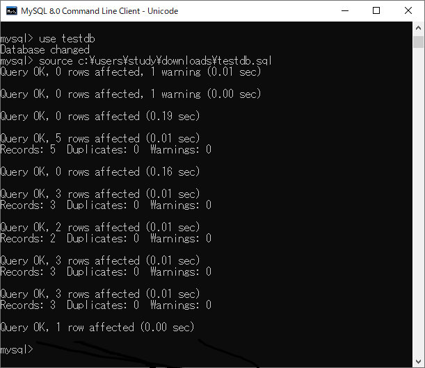
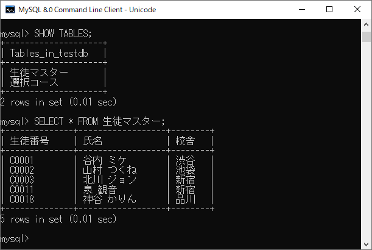
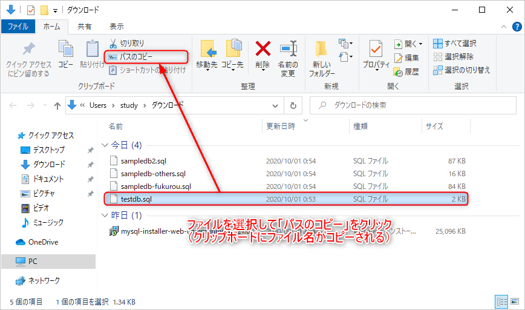
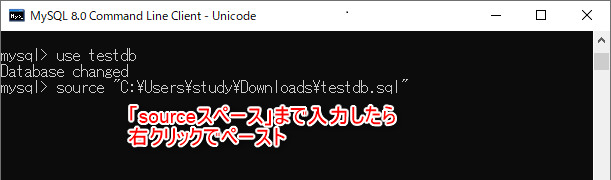
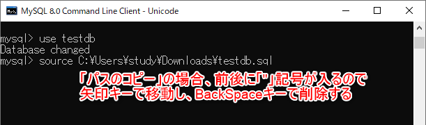

[基本がわかるSQL入門 サポートページ](https://nisim-m.github.io/sqlbook/) 
# サンプルデータのインポート（mysql）
※コマンド操作に慣れている人向け

事前に、[サンプルデータのファイル（*.sql）をダウンロード](/#sampledata)しておいてください。ここでは、testdb.sqlを使用します。

mysqlコマンドでは、`use データベース名`でデータベースを指定した後に、`source ファイル名`でSQLファイル（SQLが書かれたテキストファイル）を読み込むことができます。
useコマンドおよびsourceコマンドはmysqlコマンドの中で使用できるコマンドです。

----
【メモ】サンプルデータのファイルはUTF-8で保存されています。
**Windows環境のMariaDB**の場合、デフォルトの状態だとクライアントコマンドの画面（Windowsのコマンド画面）でUTF-8が文字化けすることから、ここで紹介しているsourceコマンドではうまく読み込むことができません。

(a)メモ帳などでサンプルデータ（testdb.sql）のファイルを開き、すべて選択してコピー→クライアント画面でデータベースを選択（use データベース名）した後、右クリックで貼り付けるか（→[参考](import-psql.md#ptnB)）、  
(b)mysqlのコマンドラインで文字コードを指定した状態でファイルを読み込む（→[参考](install-windows.md#import-mariadb-mysql)）。

という方法を採るのが簡単でしょう。

----

MySQLの場合はUTF-8用のコマンドラインクライアントの起動メニュー（メニュー名の末尾に「Unicode」とあるもの）があるので、sourceコマンドでサンプルデータを読み込むことができます。また、Linux環境やmacOS環境の場合はシステム全体のデフォルトがUTF-8なので、同じくsourceコマンドでサンプルデータを読み込むことができます。

以下は、Windows環境のMySQLでの、「c:\users\study\downloads\testdb.sql」（Windows環境でユーザー「study」の「ダウンロード」フォルダにダウンロードした場合のファイル名）を読み込む場合のコマンド例です。

```
use testdb
source c:\users\study\downloads\testdb.sql
```

Linux環境やmacOS環境で、`/tmp/testdb.sql`を読み込む場合は以下のようにします。

```
use testdb
source /tmp/testdb.sql
```

なお、コマンドラインでmysqlコマンドを実行できる場合は`mysql データベース名 -uユーザ名 -p < SQLファイル名`で読み込むこともできます。

MySQLおよびMariaDBの場合、`SHOW TABLES;`でテーブルを一覧表示できます。これはSQL文なので、末尾に`;`（セミコロン）が必要です。
なお、本書ではSQLキーワードを大文字で記載していますが、mysqlコマンド等で入力する際は小文字でもかまいません。

データのインポート（mysqlコマンドでMySQLまたはMariaDBサーバーに接続してから実行する）  
<a href="images/2020-10-01-01-09-54.png"></a>

実行結果の確認（SHOW TABLES;はテーブルを一覧表示するSQLで、MySQL/MariaDBで使用できる）  
<a href="images/2020-10-01-01-10-06.png"></a>

このほか、mysqlコマンドの画面にSQLファイルの内容をそのままコピー＆ペーストすることで実行することも可能です。
Windows環境など、GUI環境でコマンド入力用の画面を開いてmysqlコマンドを実行している場合、
1. `use データベース`でデータベースを選択する
1. メモ帳などのテキストエディタでSQLファイルを開き、ファイル全体を選択してコピーする
1. mysqlコマンドを実行している画面にペーストする
という手順でサンプルデータをまとめて登録することができます。

### パスの確認方法（Windows環境）  

Windows環境では、以下の方法でファイルのパスを確認することができます。

<a href="images/2020-10-01-01-23-16.png"></a>
<a href="images/2020-10-01-01-26-18.png"></a>
<a href="images/2020-10-01-01-27-50.png"></a>

----
[基本がわかるSQL入門 <small>——データベース&設計の基礎から楽しく学ぶ</small> サポートページ](https://nisim-m.github.io/sqlbook/)


