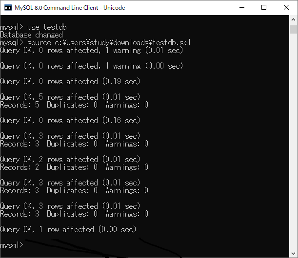
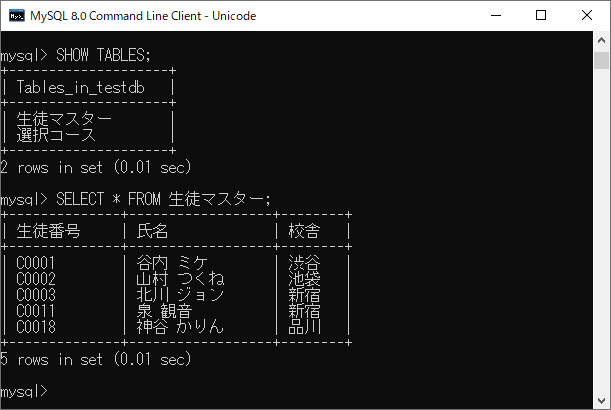
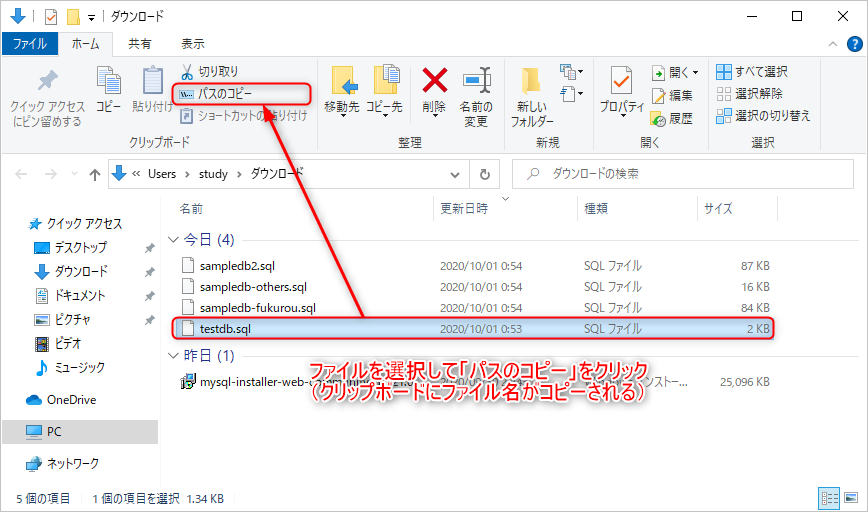
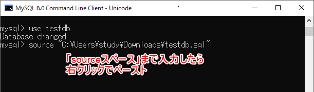
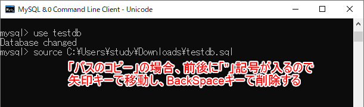

[基本がわかるSQL入門 サポートページ](https://nisim-m.github.io/sqlbook/) 
# サンプルデータのインポート（mysql）

事前に、[サンプルデータのファイル（*.sql）をダウンロード](/#sampledata)しておいてください。ここでは、testdb.sqlを使用します。

mysqlコマンドでは、「use データベース名」でデータベースを指定した後に、「souece ファイル名」でSQLファイル（SQLが書かれたテキストファイル）を読み込むことができます。

以下は「c:\users\study\downloads\testdb.sql」（Windows環境でユーザー「study」の「ダウンロード」フォルダにダウンロードした場合のファイル名）

```
use testdb
source c:\users\study\downloads\testdb.sql
```

データのインポート  
<a href="images/2020-10-01-01-09-54.png"></a>

実行結果  
<a href="images/2020-10-01-01-10-06.png"></a>

### パスの確認方法（Windows環境）  
<a href="images/2020-10-01-01-23-16.png"></a>
<a href="images/2020-10-01-01-26-18.png"></a>
<a href="images/2020-10-01-01-27-50.png"></a>

----
[基本がわかるSQL入門 <small>——データベース&設計の基礎から楽しく学ぶ</small> サポートページ](https://nisim-m.github.io/sqlbook/)


