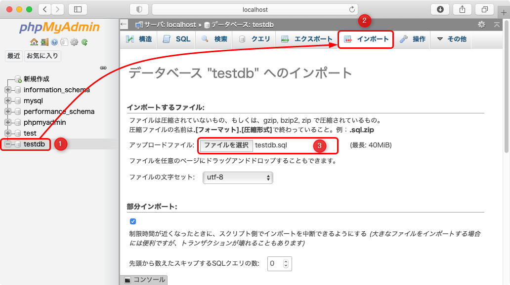
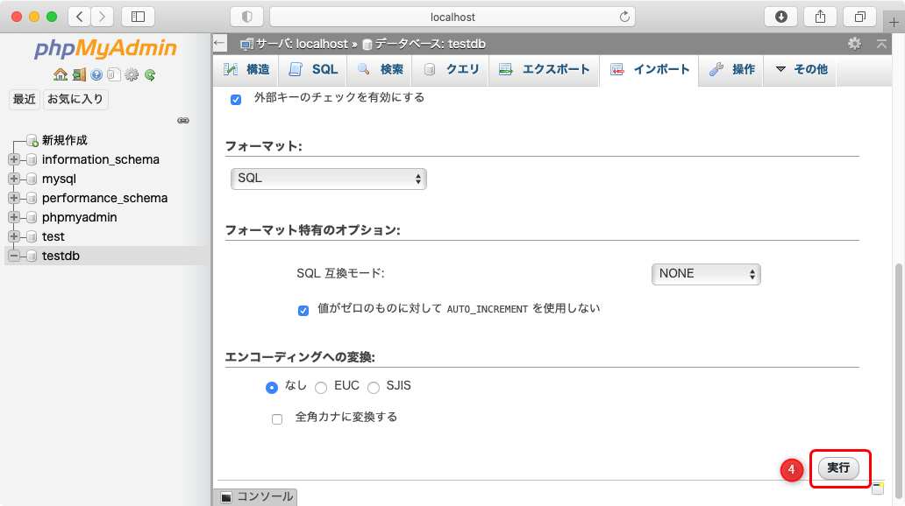
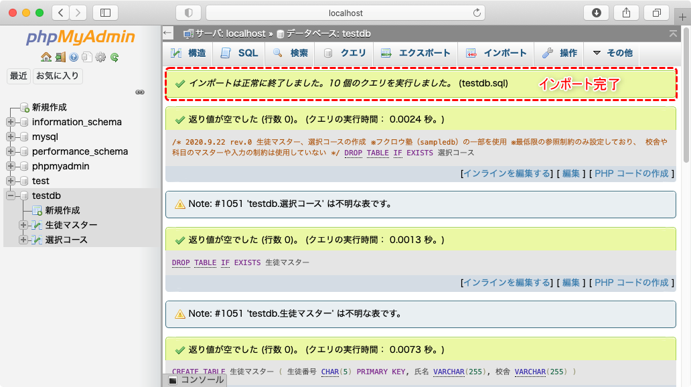
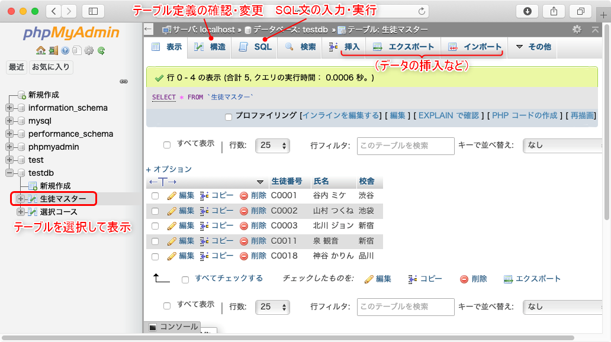

[基本がわかるSQL入門 サポートページ](https://nisim-m.github.io/sqlbook/) 
# サンプルデータのインポート（phpMyAdmin）

事前に、[サンプルデータのファイル（*.sql）をダウンロード](/#sampledata)しておいてください。ここでは、testdb.sqlを使用します。

以下のURLでphpMyAdminを開き、左ペインでデータベースを選択してから、右ペインの「インポート」タブでファイルを選択して、画面下部の「実行」ボタンをクリックします。

| 設定項目 | 値<small>（デフォルト設定と共通）</small> |
| ---- | ---- |
| ファイルの文字セット | utf-8 |
| フォーマット | SQL |

- [VirtualBox](install-ubuntu.md)環境：
    - ゲストOSの場合  
    http://localhost/phpmyadmin/  
    - ホストOSの場合  
    http://localhost:8080/phpmyadmin/  
- [XAMPP](install-xampp.md)環境：  
    - http://localhost:8080/phpmyadmin/  

データのインポート  

実行結果  

----
[基本がわかるSQL入門 <small>——データベース&設計の基礎から楽しく学ぶ</small> サポートページ](https://nisim-m.github.io/sqlbook/)
