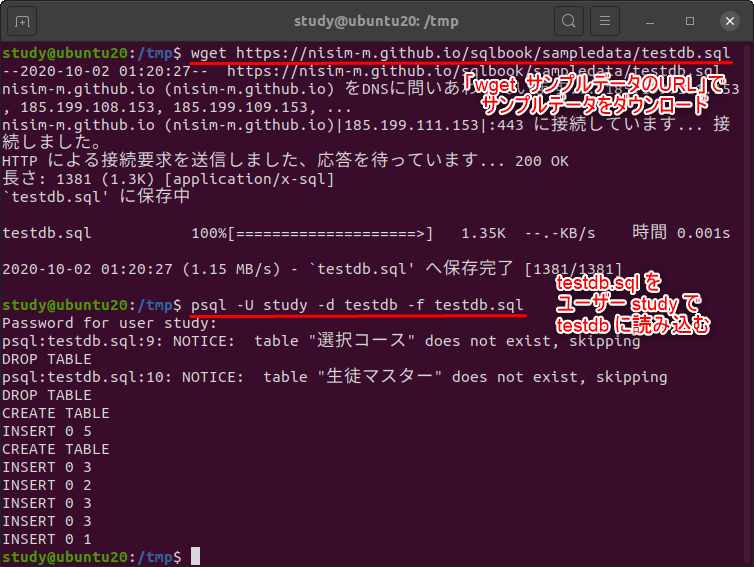
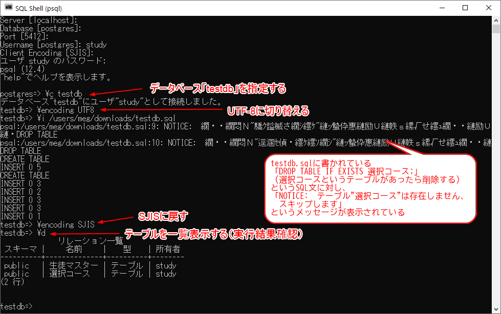
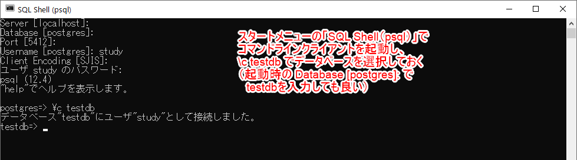
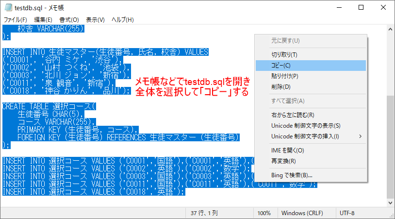
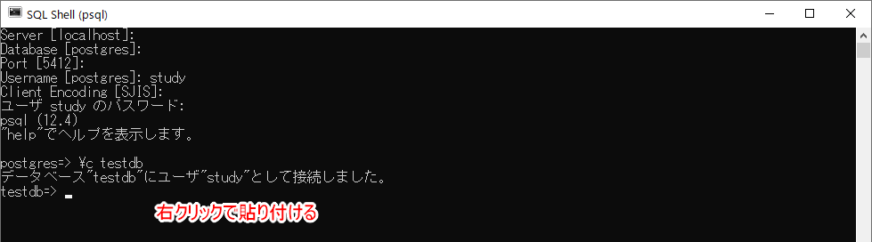
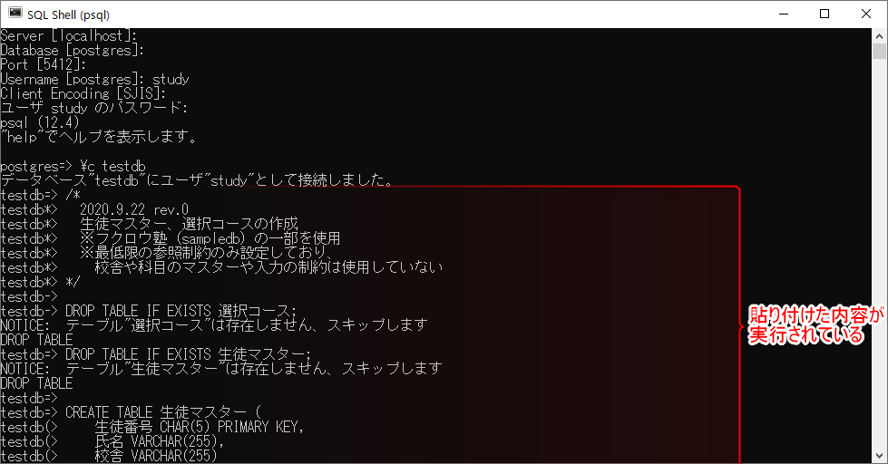
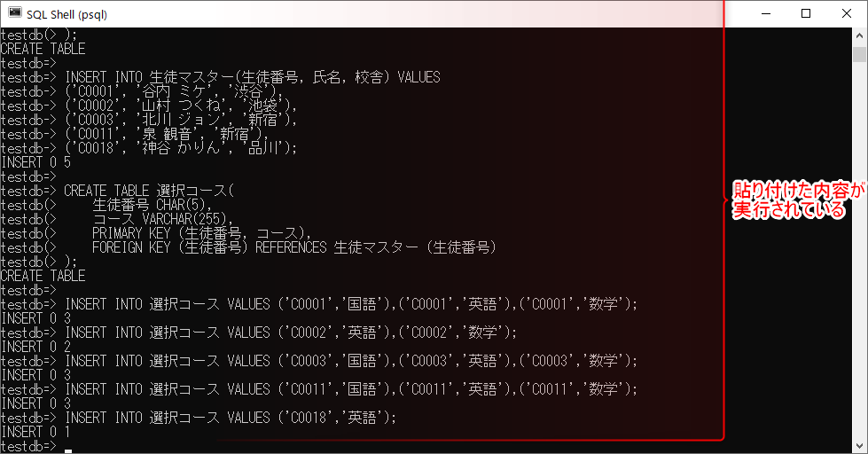
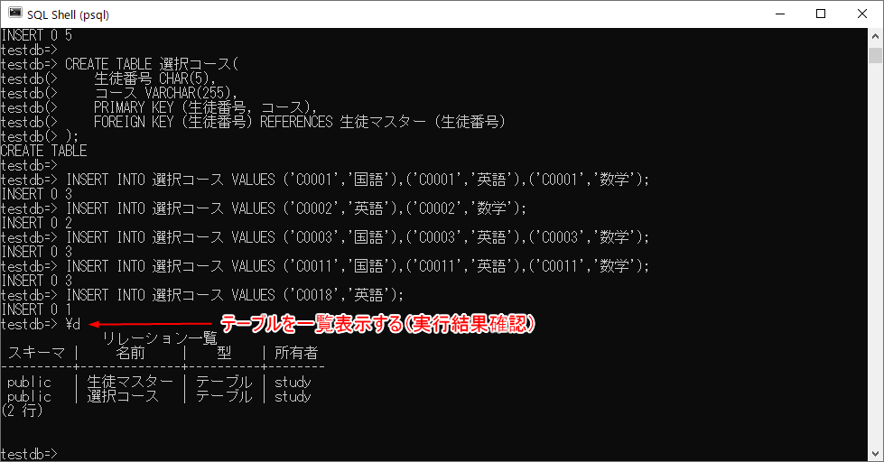

[基本がわかるSQL入門 サポートページ](https://nisim-m.github.io/sqlbook/) 
# サンプルデータのインポート（psql）
※コマンド操作に慣れている人向け

事前に、[サンプルデータのファイル（*.sql）をダウンロード](/#sampledata)しておいてください。ここでは、testdb.sqlを使用します。

psqlコマンドでは、`\c データベース名`でデータベースを指定した後に、`i ファイル名`でSQLファイル（SQLが書かれたテキストファイル）を読み込むことができます。
`\c`コマンドおよび`\i`コマンドはpsqlコマンドの中で使用できるコマンドです。

Linux環境で使用している場合や、Windowsのコマンド環境に習熟しているなどで、コマンドラインでpsqlコマンドを起動できる環境の場合、`psql -U ユーザー名 -d データベース名 -f SQLファイル名`で実行するのが簡単でしょう。

ユーザー「study」で、データベース「testdb」にtestdb.sqlのサンプルデータを登録する場合のコマンド例：
```
psql -U study -d testdb -f testdb.sql
```

実行例（Ubuntu環境）  
「wget サンプルデータのURL」でサンプルデータをダウンロードしてから実行しています  
<a href="images/2020-10-02-01-26-06.png"></a>

### Windows環境のpsqlコマンドの場合

サンプルデータのファイルはUTF-8で保存されており、データベースもUTF-8で作成するのを前提としていますが、[Windows環境のpsqlコマンド](install-windows.md#psql)の場合、クライアントコマンドでの入力と表示はシフトJIS（SJIS）を使用しています。

そこで、
[(a)](#ptnA) `\i`コマンドでファイルを読み込む時だけ、`\encoding UTF8`でUTF-8に切り替えるか、
[(b)](#ptnB) メモ帳などでサンプルデータ（testdb.sql）のファイルを開き、すべて選択してコピー→クライアント画面でデータベースを選択（use データベース名）した後、右クリックで貼り付けるという方法があります。(b)の方法は、MySQLやMariaDBのコマンドラインクライアントであるmysql.exeでも使用できます。

<a id="ptnA" name="ptnA"></a>
#### (a)ファイルを読み込む時だけUTF-8に切り替える

以下は「c:\users\study\downloads\testdb.sql」（Windows環境でユーザー「study」の「ダウンロード」フォルダにダウンロードした場合のファイル名）を読み込む場合のコマンド例です。ドライブを指定せず、ディレクトリの区切り記号を`/`にしている点に注意してください。

なお、SQLファイルを読み込んだ際に表示される警告メッセージが文字化けしますが、実行内容には問題ありません。

```
\c testdb
\encoding UTF8
\i /users/study/downloads/testdb.sql
\encoding SJIS
```

実行画面  
※実行後に`\d`でテーブル一覧を表示しています  
<a href="images/2020-10-02-00-12-44.png"></a>

<a id="ptnB" name="ptnB"></a>
#### (b)SQLコマンドをコマンドラインの画面に“コピペ”する

メモ帳などのテキストエディタで文字列を選択してコピーし、コマンドライン画面に貼り付けるという方法です。サンプルデータが書かれているSQLファイル（テキストファイル）はUTF-8で保存されていますが、コピー＆ペーストの際は、Windowsによって、コードが自動で変換されます。この方法は、MySQLやMariaDBのコマンドラインクライアントであるmysql.exeでも使用できます。

1. psqlでログインし、`\c データベース名`でデータベースの選択まで行っておく
2. テキストエディタでサンプルデータのファイルを開く（ダウンロードしたファイルを右クリック→編集で、デフォルトではメモ帳が開きます）
3. 全体を選択してコピーする
4. 1．で開いているコマンドラインクライアント画面で右クリックして貼り付ける

スタートメニューの「SQL Shell(psql)」でpsqlコマンドを起動  
<a href="images/2020-10-02-00-24-37.png"></a>

テキストエディタでサンプルデータのファイル（ここではtestdb.sql）を開き、全体を選択してコピー
<a href="images/2020-10-02-00-25-49.png"></a>

コマンド画面で右クリック  
<a href="images/2020-10-02-00-26-41.png"></a>
<a href="images/2020-10-02-00-31-03.png"></a>
<a href="images/2020-10-02-00-31-11.png"></a>

`\d`コマンドでテーブル一覧を表示（確認用）  
<a href="images/2020-10-02-00-31-54.png"></a>

----
[基本がわかるSQL入門 <small>——データベース&設計の基礎から楽しく学ぶ</small> サポートページ](https://nisim-m.github.io/sqlbook/)


