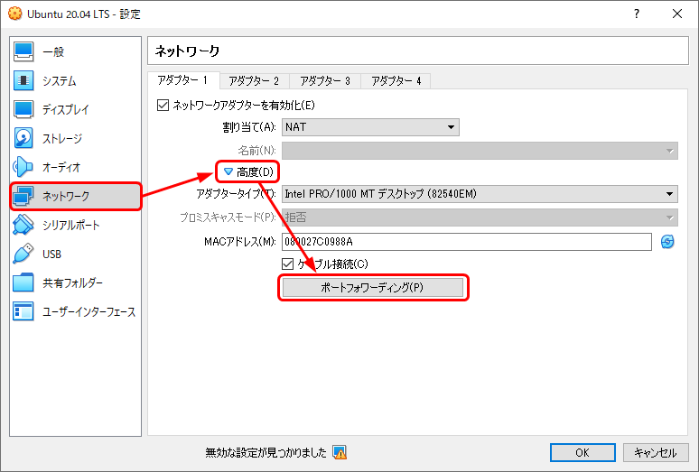
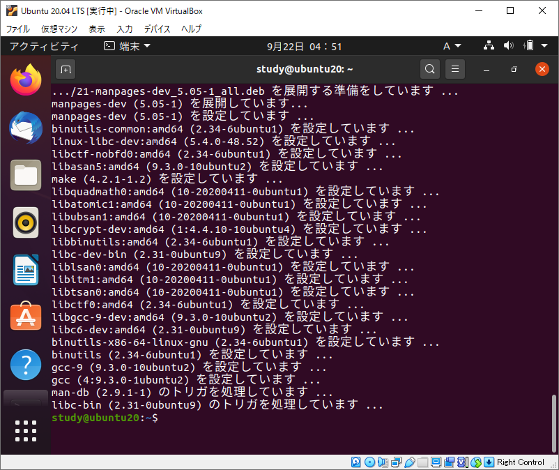
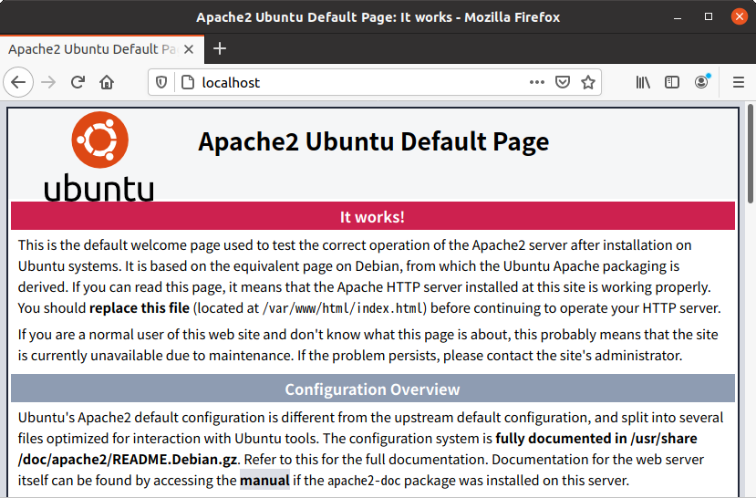
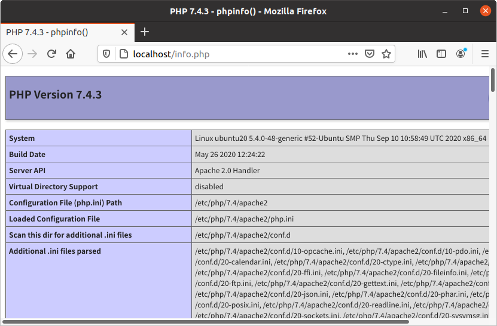
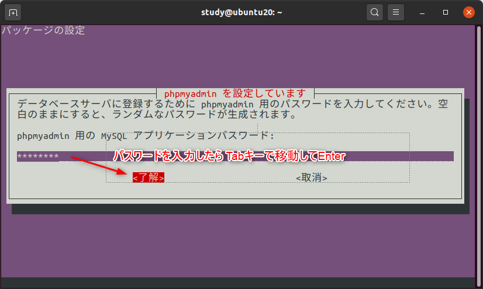

[基本がわかるSQL入門 サポートページ](https://nisim-m.github.io/sqlbook/) ～テスト環境 その1～
<a id="markdown-virtualbox--ubuntu" name="virtualbox--ubuntu"></a>
# VirtualBox + Ubuntu

<!-- TOC -->

1. [VirtualBoxの設定とゲストOS（Ubuntu）のインストール](#virtualboxの設定とゲストosubuntuのインストール)
   1. [ファイルのダウンロード](#ファイルのダウンロード)
   2. [VirtualBoxのインストール](#virtualboxのインストール)
   3. [仮想マシンの作成](#仮想マシンの作成)
   4. [Ubuntuの設定](#ubuntuの設定)
2. [ApacheとPHPのインストール<small>（WebブラウザでSQL文を試したい場合のみ）</small>](#apacheとphpのインストールsmallwebブラウザでsql文を試したい場合のみsmall)
   1. [動作確認（Apache, PHP）](#動作確認apache-php)
3. [MySQLのインストール](#mysqlのインストール)
   1. [DB管理者用パスワード設定](#db管理者用パスワード設定)
   2. [サンプル用データベースの作成](#サンプル用データベースの作成)
   3. [テスト用ユーザーの作成](#テスト用ユーザーの作成)
4. [phpMyAdminのインストール<small>（WebブラウザでSQL文を試したい場合のみ）</small>](#phpmyadminのインストールsmallwebブラウザでsql文を試したい場合のみsmall)
5. [Adminerのインストール<small>（WebブラウザでSQL文を試したい場合のみ）</small>](#adminerのインストールsmallwebブラウザでsql文を試したい場合のみsmall)
6. (参考)[PostgreSQLのインストール](#postgresqlのインストール)
   1. [DB管理者用パスワードの設定](#db管理者用パスワードの設定)
   2. [テスト用ユーザーおよびサンプル用データベースの作成](#テスト用ユーザーおよびサンプル用データベースの作成)
   3. [Webブラウザから接続するための設定](#webブラウザから接続するための設定)

<!-- /TOC -->

Ubuntuインストール後は「端末」を使い、コマンドを入力することでテスト環境に必要なソフトウェアのインストールをします。
コマンドは、以下の書式で示しています。

```
command
```

そのままコピーして使いやすくするため、プロンプトや実行結果（実行したコマンドが表示するメッセージなど）は入っていません。
実際に実行している様子の画像をつけているので、適宜参考にしてください。
また、テスト環境の構築に必要なコマンドのみを示しており、各コマンドの使い方などは紹介していないことをご了承ください。

上から順番に真似して実行すれば良いようになっていますが、「とりあえすSQLを実行してみたい」という方は、XAMPP環境の利用をお勧めします。
[XAMPPはGUI操作のみで簡単にテスト環境を構築](install-xampp.md)することができます。

<a id="markdown-virtualboxの設定とゲストosubuntuのインストール" name="virtualboxの設定とゲストosubuntuのインストール"></a>
## VirtualBoxの設定とゲストOS（Ubuntu）のインストール

<a id="markdown-ファイルのダウンロード" name="ファイルのダウンロード"></a>
### ファイルのダウンロード

#### VirtualBox
https://www.virtualbox.org/wiki/Downloads  
**VirtualBox xx.xx.xx platform packages**にOS別のダウンロードリンクがあるので、
VistualBoxをインストールするOS（ホストOS）に合ったインストーラーをダウンロードしてください。

- Windows … Windows hosts
- macOS … OS X hosts
- Linux … Linux distributions

※ここでは、Windows版を使用。

#### UbunutuのISOイメージ
https://www.ubuntulinux.jp/download  

※ここでは、「日本語 Remix イメージのダウンロード」より、Ubuntu 20.04.1 LTS（`ubuntu-ja-20.04.1-desktop-amd64.iso`）を使用。

<a id="markdown-virtualboxのインストール" name="virtualboxのインストール"></a>
### VirtualBoxのインストール

VirtualBoxのインストーラーを実行し、画面に従ってインストールを行ってください。

*※Windows環境でのインストールで<a href="images\2023-01-02-17-16-54.png">“Oracle VM VirtualBox 7.x.x needs the Microsoft Visual C++ 2019 Redistributable Packaging being installed first.”のようなメッセージ</a>が表示された場合、Microsoftのサイトからダウンロードしてインストールしてください。（<a href="https://visualstudio.microsoft.com/ja/downloads/">https://visualstudio.microsoft.com/ja/downloads/</a> “Microsoft Visual C++ Redistributable for Visual Studio 2022” [画面例](install-vcpp.md)）*


<a id="markdown-仮想マシンの作成" name="仮想マシンの作成"></a>
### 仮想マシンの作成

VirtualBoxを実行し、`仮想マシン(M)`→`新規(N)`で仮想マシンを作成します（作成および設定後、仮想マシンにゲストOSをインストールします）。

#### 名前とオペレーションシステムを入力して`次へ(N)`をクリック

- 名前 … 任意
- マシンフォルダー … 仮想マシンを保存する場所（任意）
- タイプ … Linux
- バージョン … Ubuntu (64-bit)

※仮想マシンに`Ubuntu`を含んだ名前を付けると、タイプとバージョンが自動で設定される.

<a href="images/2020-09-22-05-54-01.png"></a>

####  メモリーサイズを入力して`次へ(N)`をクリック

ゲストOSに割り当てるメモリーのサイズを入力します。たくさん割り当てることでゲストOSが快適に動作するようになりますが、その分、ホストOSの動作が犠牲になります。  
本書のサンプルを実行する場合、1024～2048MB程度で問題ありません。

<a href="images/2020-09-22-05-56-32.png"></a>

####  ハードディスクの作成

1. `仮想ハードディスクを作成する(C)`（デフォルト）を選んで`作成`をクリック
1. `VDI(VirtualBox Disk Image)`（デフォルト）を選んで`次へ(N)`をクリック
1. `可変サイズ(D)`（デフォルト）を選んで`次へ(N)`をクリック
1. サイズを入力して`作成`をクリック
本書のサンプル程度であれば、デフォルトの10GBで十分実行できますが、他の操作なども試してみたい場合はもう少し大きくしておく方が扱いやすいでしょう。なお、「可変サイズ」を選択している場合、ホストOSのディスクを消費するのはゲストOSで実際に使用した分のみです。  
（ここで紹介しているソフトウェアおよびサンプルデータをインストールした状態で約7.5GB弱のディスクを使用します）

<a href="images/2020-09-22-05-57-21.png"></a>
<a href="images/2020-09-22-05-58-21.png"></a>
<a href="images/2020-09-22-05-58-44.png"></a>
<a href="images/2020-09-22-05-59-03.png"></a>

####  グラフィックコントローラーの設定（`設定`→`ディスプレイ`）

ホストOSがWindowsの場合、ゲストOSにUbunutuのGUI環境をインストールすると起動時にエラーが出ることがあります（VirtualBox バージョン6.1.14）。  
グラフィックスコントローラーを変更しておくことで、この問題を回避できます。

`設定(S)`をクリックし、`ディスプレイ`画面の`グラフィックスコントローラー`を`VBoxSVGA`に変更

<a href="images/2020-09-22-05-59-25.png"></a>
<a href="images/2020-09-22-05-59-37.png"></a>

####  <a name="portforwarding">ホストOSから接続するための設定</a>

ホストOSからゲストOSのDBMSに接続してSQLを入力して実行したい場合は、下記を設定しておきます。
ゲストOS（Ubuntu）をインストールした後で設定することも可能です。この場合、ゲストOSをシャットダウンしてから設定してください。

ネットワーク：NAT（デフォルト）  
ネットワークアダプターを有効化にチェックマーク（デフォルト）  

`高度`→`ポートフォワーディング(P)`で以下を設定
- Webブラウザ用（http）… ホストポート 8080、ゲストポート 80
- コマンドライン用（ssh）… ホストポート 2222、ゲストポート 22

※ホストポートの番号はに任意（1024から49451の範囲で指定）。
※名前は任意、プロトコルはTCP、ホストIPとゲストIPは空欄。

<a href="images/2020-09-22-05-59-56.png"></a>
<a href="images/2020-09-22-06-00-18.png"></a>

#### `起動`でUbuntuのISOイメージを選択してUbuntuのインストーラーを起動

`起動ハードディスクを選択`という画面が表示されるので、UbuntuのISOイメージを選択して`起動`をクリックします。

<a href="images/2020-09-22-06-01-04.png"></a>
<a href="images/2020-09-22-06-00-47.png"></a>

####  Ubuntuのインストーラーが起動するので、画面に従ってインストールを実行

<a href="images/2020-09-22-06-01-35.png"></a>
<a href="images/2020-09-22-06-01-49.png"></a>
<a href="images/2020-09-22-06-03-13.png"></a>
<a href="images/2020-09-22-06-03-25.png"></a>
<a href="images/2020-09-22-06-03-49.png"></a>
<a href="images/2020-09-22-06-04-05.png"></a>
<a href="images/2020-09-22-06-04-21.png"></a>
<a href="images/2020-09-22-06-04-41.png"></a>
<a href="images/2020-09-22-06-04-53.png"></a>
<a href="images/2020-09-22-06-05-09.png"></a>
<a href="images/2020-09-22-06-05-25.png"></a>

####  Ubuntuが起動するのでインストールの続きとアップデートを実行

<a href="images/2020-09-22-06-05-41.png"></a>
<a href="images/2020-09-22-06-05-53.png"></a>
<a href="images/2020-09-22-06-06-04.png"></a>
<a href="images/2020-09-22-06-06-15.png"></a>
<a href="images/2020-09-22-06-06-26.png"></a>
<a href="images/2020-09-22-06-06-40.png"></a>
<a href="images/2020-09-22-06-06-52.png"></a>
<a href="images/2020-09-22-06-07-03.png"></a>
<a href="images/2020-09-22-06-07-18.png"></a>

再起動したらログインし、Guest Additions のインストールを行います。
Guest AdditionsはVirtualBoxのゲストOS専用のソフトウェアで、インストールすることでゲストOSの画面が見やすくなったり、ゲストOSとホストOSでコピー＆ペーストができるようになるなど、操作性が向上します。

<a href="images/2020-09-22-06-08-30.png"></a>
<a href="images/2020-09-22-06-08-47.png"></a>
<a href="images/2020-09-22-06-08-57.png"></a>


>This system is currently not set up to build kernel modules.
>Please install the gcc make perl packages from your distribution.

というメッセージが出ている場合は、必要なコマンド類を別途インストールしてからあらためてGuest Additions をインストールしてください。
[メッセージが出ていない場合は](#ga_install_completed)、Guest Additions のインストールメディアを取り出して再起動します。

<a href="images/2020-09-22-06-09-14.png"></a>

コマンド入力のために`端末`を起動する。

<a href="images/2020-09-22-06-11-13.png"></a>
<a href="images/2020-09-22-06-11-26.png"></a>

以下のコマンドを実行、パスワードを入力して［Enter］
```
sudo apt install gcc make perl
```

<a href="images/2020-09-22-06-12-09.png"></a>

（確認メッセージが表示されるので［Enter］）

<a href="images/2020-09-22-06-13-46.png"></a>
<a href="images/2020-09-22-06-14-19.png"></a>

（メディアのアイコンから`ソフトウェアの実行`）

<a href="images/2020-09-22-06-15-28.png"></a>
<a href="images/2020-09-22-06-15-42.png"></a>
<a href="images/2020-09-22-06-15-54.png"></a>

<a name="ga_install_completed">（Guest Additionsがインストールできた）</a>

<a href="images/2020-09-22-06-16-06.png"></a>

（メディアを取り出して再起動）

<a href="images/2020-09-22-06-21-24.png"></a>
<a href="images/2020-09-22-06-21-55.png"></a>
<a href="images/2020-09-22-06-22-10.png"></a>

<a id="markdown-ubuntuの設定" name="ubuntuの設定"></a>
### Ubuntuの設定

Guest Additions をインストールして再起動したら、必要に応じ、画面のサイズなどを設定する。

#### 画面の解像度変更

<a href="images/2020-09-22-06-23-13.png"></a>
<a href="images/2020-09-22-06-23-27.png"></a>

#### クリップボードの共有

ゲストOSとホストOSの間で、文字列のコピーなどを行えるようにする。  

たとえば、ホストOSのWebブラウザで本ページを表示している場合、「ホストOSからゲストOSへ」（または「双方向」）を設定することで、Webブラウザに表示されているコマンド文字列を、端末に貼り付ける（端末で右クリック→貼り付け）ことができるようになります。  
端末に表示されているエラーメッセージなどを検索したい場合は、「ゲストOSからホストOSSへ」（または「双方向」）を設定しておくことで、マウスで端末の文字列を範囲選択して右クリック→コピーでコピーし、ホストOSのWebブラウザで検索するようなことができるようになります。

<a href="images/2020-09-22-06-24-21.png"></a>


<a id="markdown-apacheとphpのインストールsmallwebブラウザでsql文を試したい場合のみsmall" name="apacheとphpのインストールsmallwebブラウザでsql文を試したい場合のみsmall"></a>
## ApacheとPHPのインストール<small>（WebブラウザでSQL文を試したい場合のみ）</small>

WebブラウザでDBMSに接続し、SQLを実行したい場合はApacheとPHPをインストールする必要があります。
コマンドラインツールのみでかまわない場合は、[MySQLのインストール](#mysql)または[PostgreSQLのインストール](#postgresql)へ進んでください。

インストールには`apt`コマンドを使用します。管理者権限が必要なため`sudo apt`のように、`sudo`と一緒に実行します。実行時にパスワードの入力を求められたら、コマンドを実行しているユーザー（ログイン時のユーザー）のパスワードを入力してください。
また、インストールは`sudo apt install 対象`のように行いますが、`sudo apt -y install 対象`のように、`-y`オプションを使用することで、実行時の確認を省略できます。
確認しながら実行したい場合は、`-y`を抜いて実行してください。

`#`から始まる行はコメントなので入力不要です。端末にコピー＆ペーストで実行する場合は、`#`から始まる行も一緒にコピー＆ペーストしてかまいません。
```
# システムを最新の状態にする(参考画面1)
sudo apt -y update
sudo apt -y upgrade

# ApacheとPHPをインストールする
sudo apt -y install apache2 php

# インストールされたApacheとPHPのバージョンを確認する
apache2 -v
php -v

# Apacheが起動できているかを確認する(［q］キーで終了、参考画面2）
sudo systemctl status apache2
```

※**active**と表示されていない場合は、`sudo systemctl restart apache2`を実行してエラーが表示されないか、
また、再度`sudo systemctl status apache2`を実行してみてメッセージを確認する。
（メッセージの中に、参照すべきログや、不足しているファイル、設定などが出力されている。
わからない場合は、メッセージやログに出ている文字列でGoogle検索等を行うとヒントを得ることができる、ことが多い）

```
# システム起動時にApacheも起動するよう設定
sudo systemctl enable apache2
```
参考画面1  
<a href="images/2020-09-22-14-31-12.png"></a>  
参考画面2  
<a href="images/2020-09-22-14-35-06.png"></a>

<a id="markdown-動作確認apache-php" name="動作確認apache-php"></a>
### 動作確認（Apache, PHP）

ApacheとPHPの連携を確認するため、`/var/www/html/info.php`というファイルを作成し、Webブラウザでの表示内容を確認します。
nanoコマンドはテキストエディタで、使用方法は画面の下に表示されています。`^`はCtrlキーの略で、たとえば`^X`は`Ctrl+X`という操作です。

```
sudo nano /var/www/html/info.php
```
以下の内容を入力し、保存して終了する。
```
<?php phpinfo(); ?>
```

nano実行画面  
<a href="images/2020-09-22-14-42-44.pn"></a>

クライアントOSのWebブラウザ（VirtualBox内のFirefox）
http://localhost
下記の様な画面が表示されない場合は、Apacheのインストールおよび起動ができているか、エラーが出ていないかを確認。

<a href="images/2020-09-22-14-43-16.png"></a>

http://localhost/info.php
下記の様な画面が表示されない場合は、PHPのインストールができているか、Apacheを再起動して（``）エラーが出ていないかを確認。

<a href="images/2020-09-22-14-43-31.png"></a>

<a href="#portforwarding">ポートフォワーディングの設定</a>を行っている場合、ホストOSのWebブラウザでも確認できる。
この場合、URLは以下の様にする（8080はホストOS側で設定した値）。

http://localhost:8080  
http://localhost:8080/info.php  

ホストOS（Windows10）での表示  
<a href="images/2020-09-22-14-43-55.png"></a>
<a href="images/2020-09-22-14-44-06.png"></a>

<a id="markdown-mysqlのインストール" name="mysqlのインストール"></a>
## MySQLのインストール

```
# MySQLおよびPHPから接続するためのツールをインストール
sudo apt -y install mysql-server php-mysql

# MySQL（サーバー）が起動できているかを確認する(［q］キーで終了）
sudo systemctl status mysql
```
※`active`と表示されていない場合は、`sudo systemctl restart mysql`を実行してエラーが表示されないか、
また、再度`sudo systemctl status mysql`を実行してメッセージを確認する。

```
# システム起動時にMySQL（サーバー）も起動するよう設定
sudo systemctl enable mysql
```

<a href="images/2020-09-22-14-44-50.png"></a>

<a id="markdown-db管理者用パスワード設定" name="db管理者用パスワード設定"></a>
### DB管理者用パスワード設定

`mysql_secure_installation`コマンドで、最低限のセキュリティ設定およびデータベース管理者（root）でMySQLサーバーに接続する際のパスワードを設定します。
root用のパスワードを入力する他は、基本的に、すべて「y」で処理を進めてください。

```
sudo mysql_secure_installation
```

<a href="images/2020-09-22-15-00-01.png"></a>
<a href="images/2020-09-22-15-03-52.png"></a>

<a id="markdown-サンプル用データベースの作成" name="サンプル用データベースの作成"></a>
### サンプル用データベースの作成

mysqlコマンド（MySQLサーバーに接続するためのコマンド）で、サンプル用のデータベースと、データベースに接続するためのユーザーを作成します。
ここでは、Ubuntuをインストールする際に作成したユーザー名と同じ名前のユーザー（study）を作成しています。

```
# mysqlを実行（オプションは、ユーザー「root」、パスワードを使用して接続という意味）
sudo mysql -u root -p
```

<a href="images/2020-09-22-15-26-53.png"></a>

mysqlが起動すると、`mysql>`というプロンプトが表示されるので、以下のコマンドを実行します。
※ `--`以降はコメントなので入力不要です。この画面からコピー＆ペーストして実行する場合は`--`以降の部分も一緒にペーストしてかまいません。
※SQLのキーワードは大文字にしていますが、入力は小文字でもかまいません（p.24 2.1節「SQLの種類と基本的な書式」）。

```
-- サンプルデータベース用のデータベース3つを作成
CREATE DATABASE testdb default character set utf8mb4;
CREATE DATABASE sampledb default character set utf8mb4;
CREATE DATABASE sampledb2 default character set utf8mb4;

-- 確認（MySQLで管理しているデータベースが一覧表示される）
SHOW DATABASES; 
```
※作成済のデータベースを削除してから改めて作成したい場合、たとえば「testdb」であれば`DROP DATABASE testdb;`を先に実行してからCREATE DATABASE…を実行。

<a href="images/2020-09-22-15-32-23.png"></a>

<a id="markdown-テスト用ユーザーの作成" name="テスト用ユーザーの作成"></a>
### テスト用ユーザーの作成

続いて、テスト用のユーザーを作成します。`study`部分はデータベースに接続するユーザー、`mypqssword`部分は接続に使用するパスワードです。
適宜、ご自身のユーザー名と使用したいパスワードに置き換えて実行してください。
なお、パスワードは`ALTER USER ユーザー名 IDENTIFIED BY '新しいパスワード'`で変更できます。

```
-- データベース接続用のユーザーを作成
-- CREATE USER 'ユーザー名'@'localhost' IDENTIFIED BY 'データベース接続用のパスワード';
CREATE USER 'study'@'localhost' IDENTIFIED BY 'mypassword';
```

作成したデータベースに対し、データの追加や削除などを含めたすべての権限を与えます。
`WITH GRANT OPTION`は権限の追加や削除も行えるようにするためのオプションです。

```
GRANT ALL ON testdb.* TO 'study'@'localhost' WITH GRANT OPTION;
GRANT ALL ON sampledb.* TO 'study'@'localhost' WITH GRANT OPTION;
GRANT ALL ON sampledb2.* TO 'study'@'localhost' WITH GRANT OPTION;
```

設定した権限を再読込してmysqlコマンドを終了します。

```
FLUSH PRIVILEGES;
quit
```
<a href="images/2020-09-22-15-36-11.png"></a>

<a id="markdown-phpmyadminのインストールsmallwebブラウザでsql文を試したい場合のみsmall" name="phpmyadminのインストールsmallwebブラウザでsql文を試したい場合のみsmall"></a>
## phpMyAdminのインストール<small>（WebブラウザでSQL文を試したい場合のみ）</small>

phpMyAdminは、PHPという開発言語によるMySQLの管理ツールで、Webブラウザを使ってSQL文の実行ができるほか、データベースやユーザーの作成なども可能です。
MySQLサーバーが利用できるレンタルサーバーにもよく使われています（レンタルサーバーの場合、管理コマンドは実行できないよう制限されている場合があります）。

phpMyAdminは以下のコマンドでインストールできます。
インストール中に設定画面が開くので「apache2」を選択、「dbconfig-common」で「了解」を選択して、画面に従ってパスワードを入力してください（参考画面1～6）。
```
sudo apt -y install phpmyadmin
```
インストールが完了すると、以下のURLでMySQLに接続できます（参考画面7～8）。

http://localhost/phpmyadmin/  

ホストOSからアクセスする場合は以下のURLを仕様します。  
http://localhost:8080/phpmyadmin/  

参考画面1～6  
<a href="images/2020-09-22-19-15-53.png"></a>
（apt install 実行中に以下の画面が表示される）  
<a href="images/2020-09-22-19-20-25.png"></a>
<a href="images/2020-09-22-19-26-03.png"></a>
<a href="images/2020-09-22-19-28-45.png"></a>
<a href="images/2020-09-22-19-29-06.png"></a>
<a href="images/2020-09-22-19-30-05.png"></a>

参考画面7,8 phpMyAdmin（ゲストOS）  
<a href="images/2020-09-22-19-48-59.png"></a>
<a href="images/2020-09-22-19-57-30.png"></a>

<a id="markdown-adminerのインストールsmallwebブラウザでsql文を試したい場合のみsmall" name="adminerのインストールsmallwebブラウザでsql文を試したい場合のみsmall"></a>
## Adminerのインストール<small>（WebブラウザでSQL文を試したい場合のみ）</small>

Adminerは、phpMyAdminと同じくPHPで開発されたデータベース管理ツールです。
MySQL/MariaDBの他、PostgreSQLに接続して使用することも可能です。

ファイル1つで実行でき、とても手軽です。
ここでは、`wget`コマンドでバージョン4.7.7（2020年9月現在の最新版）をダウンロードし、`/var/www/html/`に`adminer.php`という名前で配置しています。

```
wget https://github.com/vrana/adminer/releases/download/v4.7.7/adminer-4.7.7.php
sudo mv adminer-4.7.7.php /var/www/html/adminer.php
```

完了すると、以下のURLでMySQLに接続できます。

http://localhost/adminer.php  

ホストOSからアクセスする場合は  
http://localhost:8080/adminer.php  

<a href="images/2020-09-22-20-03-44.png"></a>
<a href="images/2020-09-22-20-00-42.png"></a>

<a id="markdown-postgresqlのインストール" name="postgresqlのインストール"></a>
## PostgreSQLのインストール

```
# PostgreSQLサーバーおよびPHPから接続するためのツールをインストール
sudo apt -y install postgresql php-pgsql

# PostgreSQL（サーバー）が起動できているかを確認する(［q］キーで終了、画像参照)
sudo systemctl status postgresql

# システム起動時にPostgreSQL（サーバー）も起動するよう設定
sudo systemctl enable postgresql

# PHP拡張（php-pgsql）をインストールしたのでApacheを再起動
sudo systemctl restart apache2
```

<a href="images/2020-09-22-19-12-10.png"></a>

※`systemctl status postgresql`でactiveと表示されていない場合は、`sudo systemctl restart postgresql`を実行してエラーが表示されないか、
また、再度`sudo systemctl status postgresql`を実行してメッセージを確認する。

<a id="markdown-db管理者用パスワードの設定" name="db管理者用パスワードの設定"></a>
### DB管理者用パスワードの設定

まず、管理者用（postgres）のパスワードを設定します。ここでは`psql`コマンドを使用しています。  
`psql`コマンドはPostgreSQLサーバーに接続するためのコマンドで、MySQLの`mysql`コマンドに相当します。

`psql`だけで実行すると`postgres=# `というプロンプトが表示されてSQLを実行できる他、`psql -c "SQL文"`でSQL文を実行することができます。  
ここでは、こちらの方法でALTER文を実行しています。SQLキーワードは大文字で示していますが、入力は小文字でかまいません（p.24 2.1節「SQLの種類と基本的な書式」）。

なお、PostgreSQLの管理者はpostgresというユーザーなので、ここでは`sudo -u postgres psql -c "SQL文"のようにsudoコマンドを使用して実行しています。  
※sudoコマンドの`-u`オプションは、どのユーザーの権限で実行するかを指定するオプションで、省略時はrootの権限で実行されます。

```
# 管理者用のパスワードを設定
# ALTER USER ユーザー名 WITH PASSWORD 'DB管理者用のパスワード' を実行
sudo -u postgres psql -c "ALTER USER postgres WITH PASSWORD 'adminpassword'"
```

<a href="images/2020-09-22-19-09-48.png"></a>

<a id="markdown-テスト用ユーザーおよびサンプル用データベースの作成" name="テスト用ユーザーおよびサンプル用データベースの作成"></a>
### テスト用ユーザーおよびサンプル用データベースの作成

テスト用のユーザー「study」を作成し、サンプル用データベース「testdb」「sampledb」「sampledb2」を作成します。  

PostgreSQLの場合、ユーザー作成用およびデータベース作成用のコマンドが用意されています。
ここでは、テスト用のユーザーとして、Ubuntuをインストールする際に作成したユーザー名と同じ名前のユーザー（study）を作成しています。

```
sudo -u postgres createuser study
sudo -u postgres createdb -E utf-8 -O study testdb
sudo -u postgres createdb -E utf-8 -O study sampledb
sudo -u postgres createdb -E utf-8 -O study sampledb2
```

※参考：SQL文で実行する場合（sudo -u postgres psqlでPostgreSQLに接続して実行）
```
-- （参考）
CREATE USER study PASSWORD 'DB接続用のパスワード';
CREATE DATABASE testdb OWNER study ENCODING 'UTF-8';
```

先ほどと同じALTER文で、テスト用のユーザー「study」がPostgreSQLに接続する際のパスワードを設定します。

```
# テスト用ユーザー（study）のパスワードを設定
# ALTER USER ユーザー名 WITH PASSWORD 'study用のパスワード' を実行
sudo -u postgres psql -c "ALTER USER study WITH PASSWORD 'mypassword'"
```

<a id="markdown-webブラウザから接続するための設定" name="webブラウザから接続するための設定"></a>
### Webブラウザから接続するための設定

PostgreSQLにWebブラウザ（[Adminer](#adminer)を使用）から接続する場合、設定ファイル`pg_hba.conf`に設定を1行追加する必要があります。
ここでは、`nano`コマンド（テキストエディタ）で設定ファイルを開き、`local all study md5`という行を追加しています（参考画像）。これは、studyというユーザーはパスワードを使って接続する、という意味の設定です。接続方法の設定は`pg_hba.conf`の上に書かれている行から順番に評価されるので、なるべく上の方に追加すると良いでしょう。

```
sudo nano /etc/postgresql/12/main/pg_hba.conf
```

追加したら、以下のコマンドでPostgreSQLサーバーを再起動します。
```
sudo systemctl restart postgresql
```

テキストエディタで`local  all  study  md5`という行を追加  
<a href="images/2020-09-22-20-11-35.png"></a>

Adminerで接続する際には、「データベース種類」で「PostgreSQL」を選択して接続します。

<a href="images/2020-09-22-20-04-13.png"></a>

[→サンプルデータ](../index.md#sampledata)

----
[基本がわかるSQL入門 <small>——データベース&設計の基礎から楽しく学ぶ</small> サポートページ](https://nisim-m.github.io/sqlbook/)
