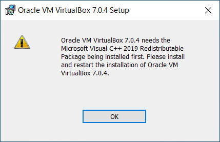
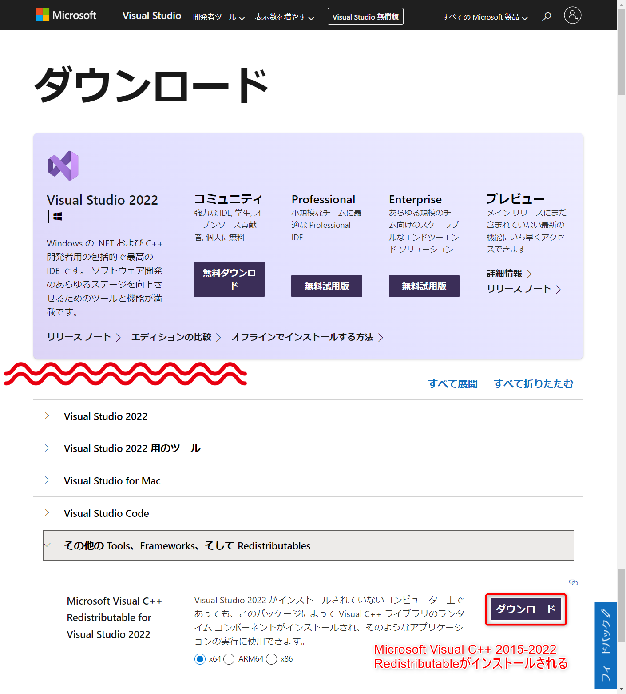

※“Oracle VM VirtualBox 7.x.x needs the Microsoft Visual C++ 2019 Redistributable Packaging being installed first.”のようなメッセージが表示された場合、
Microsoftのサイトからダウンロードしてインストールしてください。

メッセージ例

<a href="https://visualstudio.microsoft.com/ja/downloads/">https://visualstudio.microsoft.com/ja/downloads/</a> で、“その他の Tools、Frameworks、そして Redistributables” にある “Microsoft Visual C++ Redistributable for Visual Studio 2022”をダウンロードします。

ダウンロードしたファイルを実行することで、“Microsoft Visual C++ 2015-2022 Redistributable”がインストールされます。※2023/1現在

<a href="https://visualstudio.microsoft.com/ja/downloads/">https://visualstudio.microsoft.com/ja/downloads/</a>

