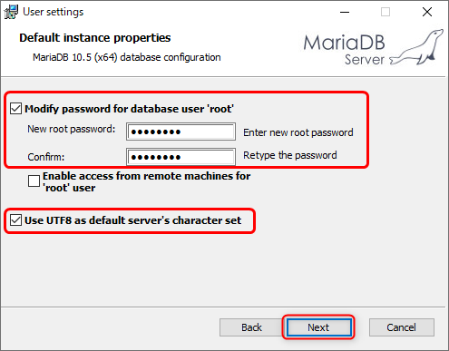

[基本がわかるSQL入門 サポートページ](https://nisim-m.github.io/sqlbook/) 

## MariaDBのインストール（Windows環境）
テスト環境 その3 [DBMSのみ（Windows）](install-windows.md#mariadb-install)より  
以下は`mariadb-10.5.5-winx64.msi`による実行例です。

インストーラーが起動するので「Next」をクリック  

ライセンスに合意して「Next」をクリック  

セットアップ内容を確認して「Next」をクリック（デフォルトのままで良い）  

※参考（データベースサーバーだけで良い場合）  

データベース管理者（root）のパスワードを入力、「Use UTF8…」を有効にして「Next」をクリック  

必要に応じ、**ポート番号を変更**する  
MySQLサーバーなどと共存させたい場合は、異なるポート番号にする（1024から49451の範囲で指定、デフォルトは3306）  
デフォルトではMariaDBサーバーがWindowsサービスとして起動する（実行状態はタスクマネージャーの詳細→サービスで確認、同画面の「サービス管理ツールを開く」で自動起動の設定を変更できる）  

「Install」でインストールが開始される    

→ テスト環境 その3 [DBMSのみ（Windows）](install-windows.md#mariadb-install)に戻る

----
[基本がわかるSQL入門 <small>——データベース&設計の基礎から楽しく学ぶ</small> サポートページ](https://nisim-m.github.io/sqlbook/)