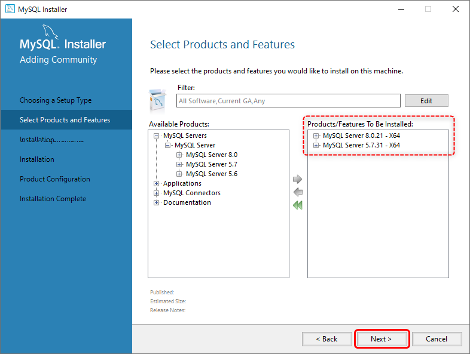
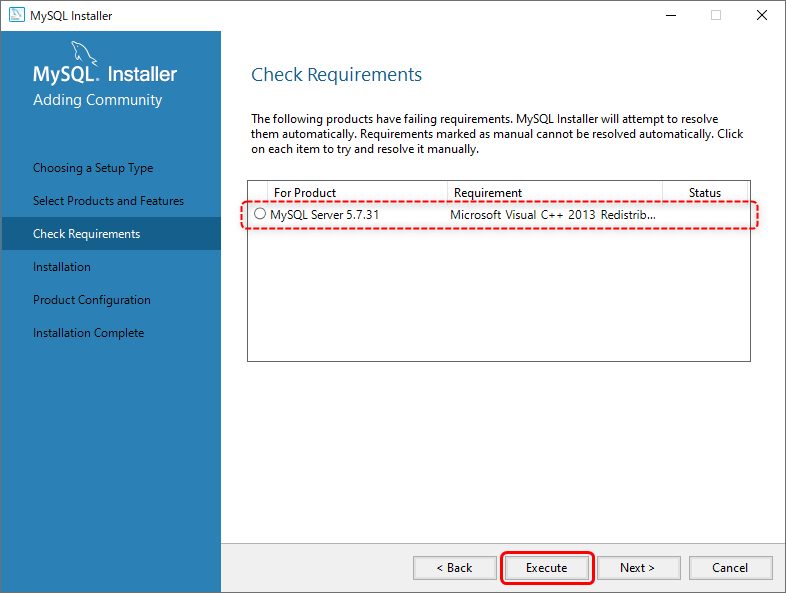
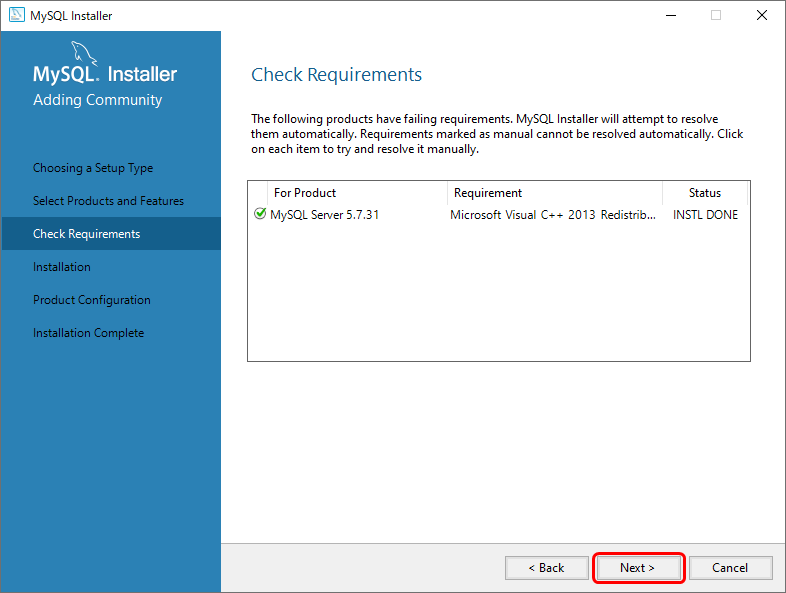
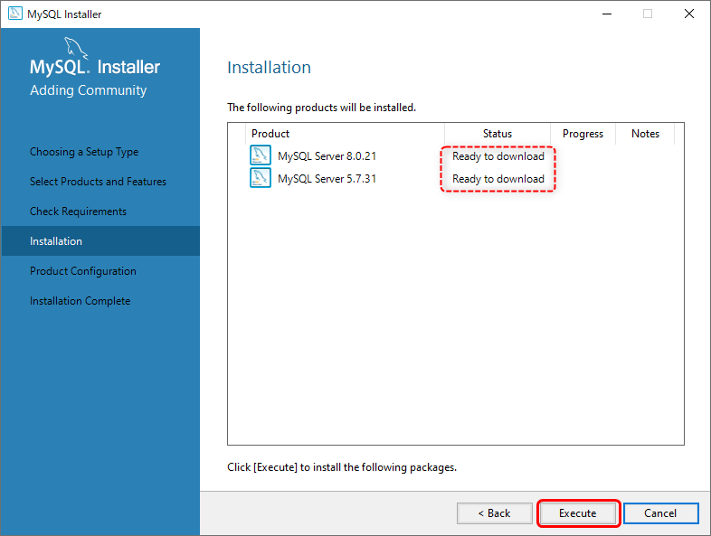
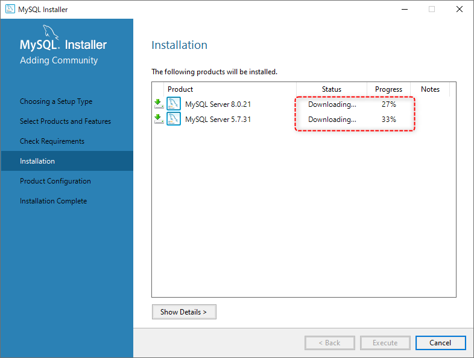
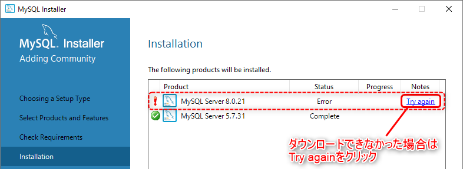
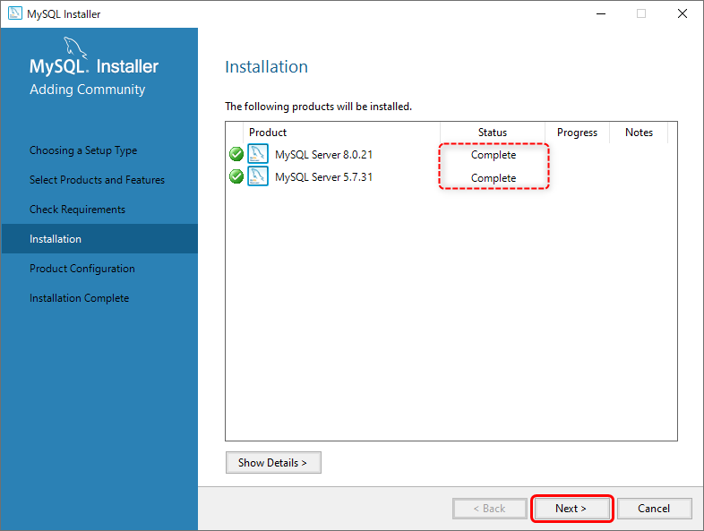
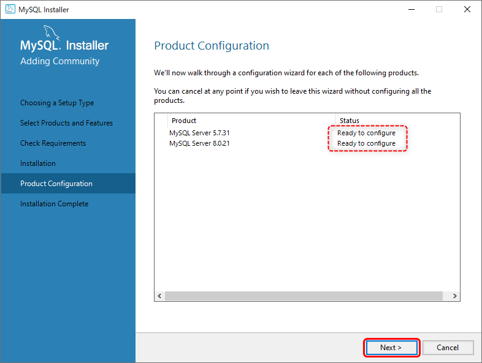
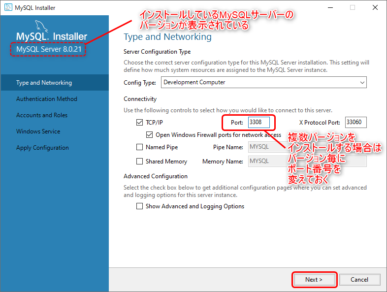
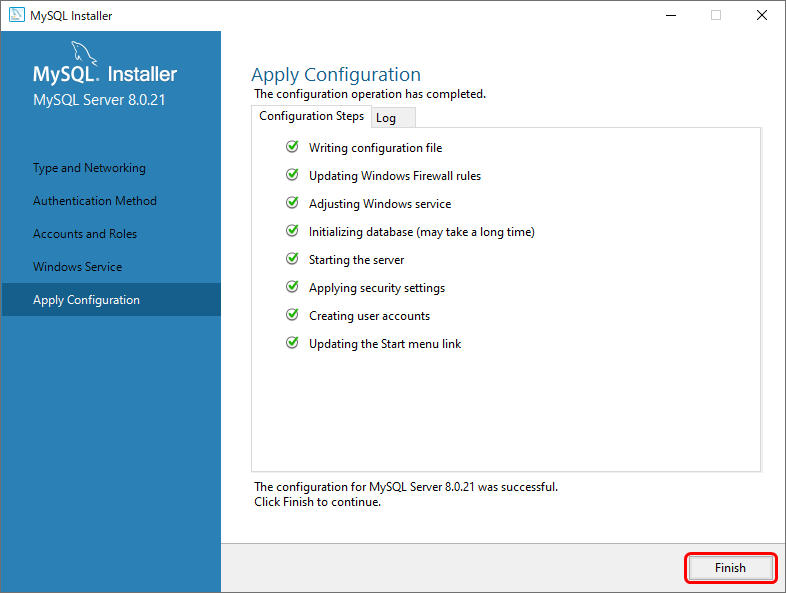

[基本がわかるSQL入門 サポートページ](https://nisim-m.github.io/sqlbook/) 

## MySQLのインストール（Windows環境）
テスト環境 その3 [DBMSのみ（Windows）](install-windows.md#mysql-install)より  
以下は`mysql-installer-web-community-8.0.21.0.msi`による実行例です。

  

アップデートのメッセージが出ていた場合は「OK」をクリック  

サーバーだけで良い場合や複数バージョンをインストールしたい場合は「Custom」を選択  

サーバーを選んで右矢印をクリックして追加  

（他のバージョンが必要な場合は追加）  

必要なバージョンが選択できたら「Next」をクリック（後で追加することも可能）  

バージョンによっては追加ソフトウェア（Microsoft Visual C++のライブラリ）が必要になることがあります。
**「Execute」をクリック**することでインストールできます。  

（Microsoft Visual C++ 2013 ※MySQL 5.7用）  

追加ソフトウェアのインストールが完了したら「Next」をクリック  

「Read to download」と表示されたら「Execute」をクリック  

ダウンロード開始  

※ダウンロードできなかった場合「Error」と表示されるので「Try again」をクリック  

ダウンロードが終わると「Complete」と表示されるので「Next」で進める  

「Ready to configure」と表示されるので「Next」で設定を開始する  

「Type and Networking」画面で**ポート番号を設定**する  
複数バージョンをインストールする場合は、バージョン毎にポート番号を変えておく（1024から49451の範囲で指定、デフォルトは3306）  

管理者用のパスワードを入力し、「Add User」でテスト用のユーザーを追加する  
  

ユーザー名を入力（任意、ここでは「study」）して、ホストは「localhost」にする  
データベースの作成やデータのインポートを行うユーザーの場合、ロールは「DB Admin」にする  
パスワードを入力して「OK」をクリック（自分専用のローカルPCで使用する場合は簡単なパスワードでも良い）   

ユーザーを追加したら「Next」で進める  

デフォルトでは、Windows起動時にMySQLサーバーがWindowsサービスとして起動する（変更可能、実行状態はタスクマネージャーの詳細→サービスで確認できる）  

「Execute」でインストールを実行（設定を修正したい場合は「Back」で戻る）  

複数バージョンをインストールする場合は「Product Configuration」が再度表示されるので「Next」をクリック  

同様に設定を行う  

MySQL 8.0の場合、「Authentication Method」画面が表示される  
通常は新しい認証方式（デフォルト）を使用。他システム（Microsoft Accessなど）と組み合わせて使用したい場合など、状況によっては古い認証方式にするケースがある（※本ページでは扱っていません）  

サーバー管理者用のパスワードを設定し、テスト用のユーザーを追加する  

完了すると「Installation Complete」と表示されるので「Finish」をクリック  

→ テスト環境 その3 [DBMSのみ（Windows）](install-windows.md#mysql-install)に戻る

----
[基本がわかるSQL入門 <small>——データベース&設計の基礎から楽しく学ぶ</small> サポートページ](https://nisim-m.github.io/sqlbook/)