[基本がわかるSQL入門 サポートページ](https://nisim-m.github.io/sqlbook/) 

## PostgreSQLのインストール（Windows環境）
テスト環境 その3 [DBMSのみ（Windows）](install-windows.md#postgresql-install)より  
以下は`postgresql-12.4-1-windows-x64.exe`による実行例です（`postgresql-13.0-1-windows-x64.exe`も同じ手順でインストール可能です）。

<a href="images/2020-10-01-21-28-28.png">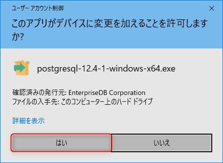</a>

インストーラーが起動するので「Next」をクリック  
<a href="images/2020-10-01-21-29-18.png">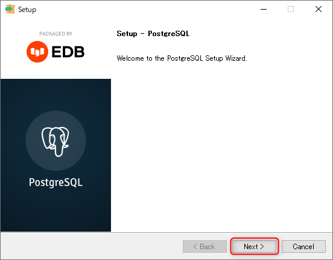</a>

<a href="images/2020-10-01-21-30-14.png">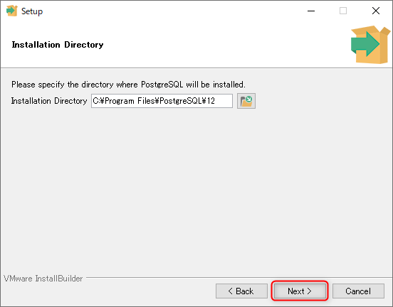</a>

選択内容を確認して「Next」をクリック（デフォルトのままで良い）  
<a href="images/2020-10-01-21-32-55.png">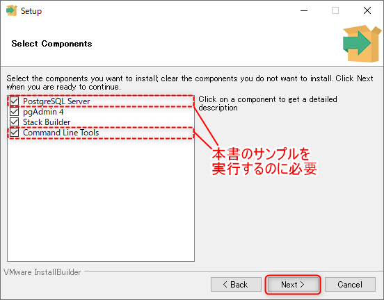</a>

<a href="images/2020-10-01-21-33-25.png">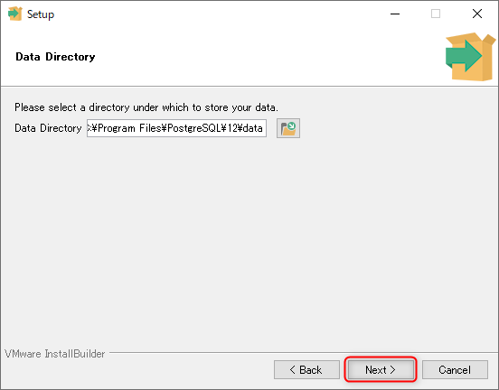</a>

データベース管理者（postgres）のパスワードを入力  
<a href="images/2020-10-01-21-33-49.png">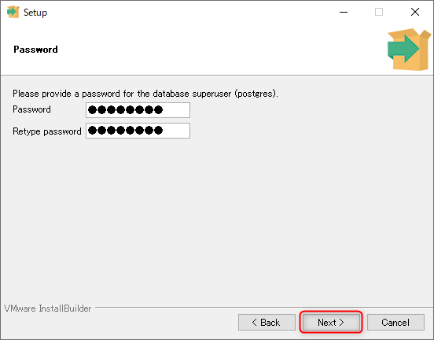</a>

必要に応じ、**ポート番号を変更**する
複数バージョンを共存させたい場合は、バージョン毎にポート番号を変えておく（1024から49451の範囲で指定、デフォルトは「5432」）  
<a href="images/2020-10-01-21-36-09.png">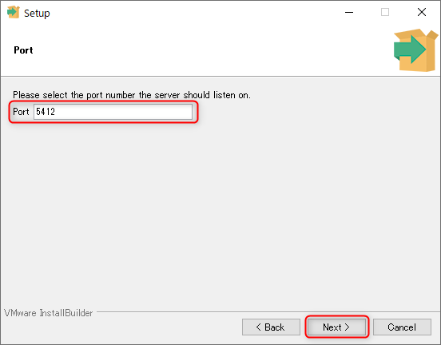</a>
<a href="images/2020-10-01-21-36-43.png">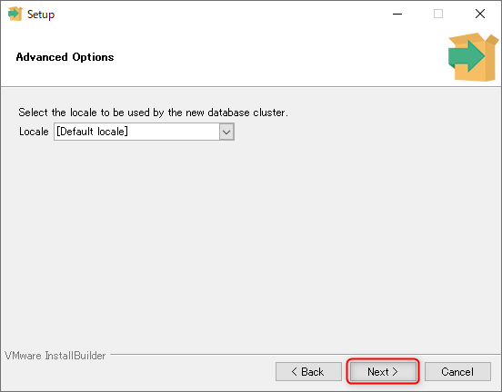</a>
<a href="images/2020-10-01-21-37-18.png">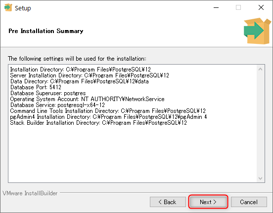</a>

Stack Builder（開発等で使用する補助ツール）が不要な場合はオフにする  
※インストール後、スタートメニューの「Application Stack Builder」で追加、設定可能。本書では使用しない。  
<a href="images/2020-10-01-21-40-10.png">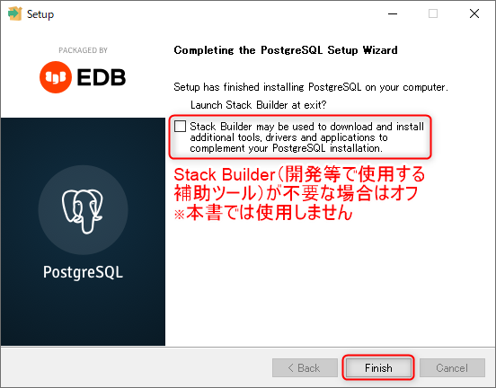</a>

※参考  
Stack Builderのチェックを入れたまま「Finish」をクリックした場合、「スタックビルダ」の画面が開くので、不要な場合は「Cancel」をクリックする  
<a href="images/2020-10-01-21-42-15.png">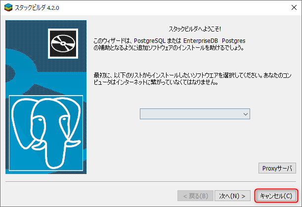</a>

→ テスト環境 その3 [DBMSのみ（Windows）](install-windows.md#postgresql-install)に戻る

----
[基本がわかるSQL入門 <small>——データベース&設計の基礎から楽しく学ぶ</small> サポートページ](https://nisim-m.github.io/sqlbook/)
