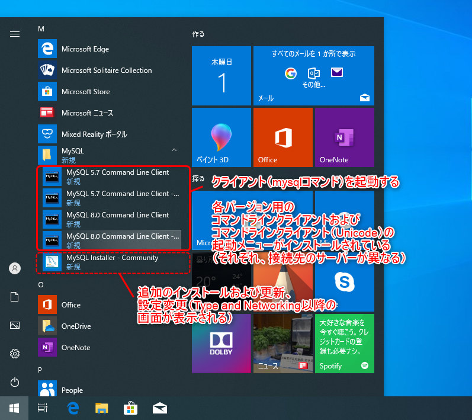
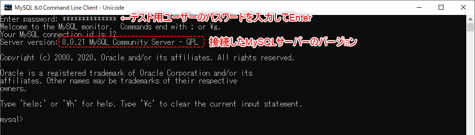
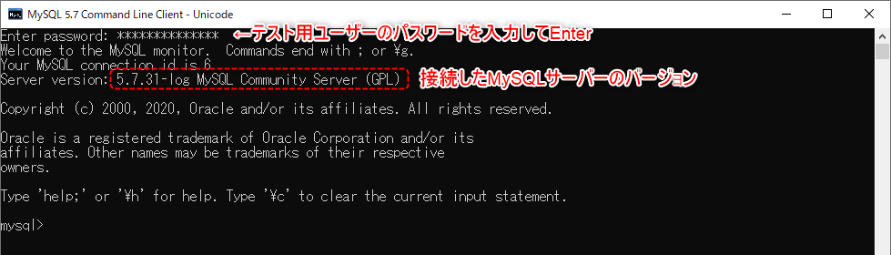
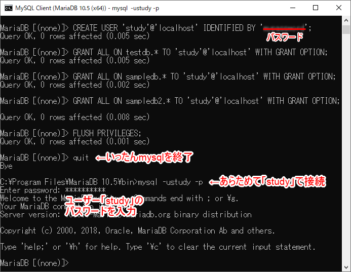
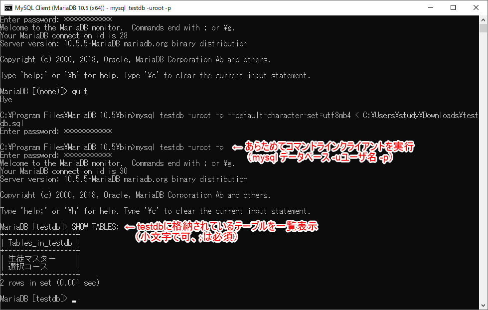
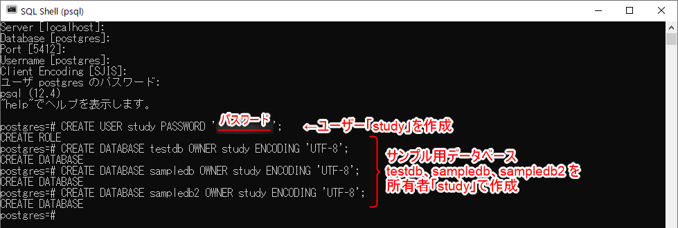

[基本がわかるSQL入門 サポートページ](https://nisim-m.github.io/sqlbook/) ～テスト環境 その3～

Windows環境に、MySQL、MariaDB、PostgreSQLをインストールする方法。  
いずれかを選択してインストール、ポート番号が重複しなければ共存可能。
※本書掲載のSQL文は、上記3種類を使用して動作確認を行っており、サンプルデータによる実行結果はMySQL(ver8)によるものを掲載しています。

<!-- TOC -->

1. [MySQL](#mysql)
   1. [MySQLサーバーのインストール](#mysqlサーバーのインストール)
   2. [コマンドラインクライアント（mysqlコマンド）の起動](#コマンドラインクライアントmysqlコマンドの起動)
   3. [データベースの作成（mysqlコマンド）](#データベースの作成mysqlコマンド)
2. [MariaDB](#mariadb)
   1. [MariaDBサーバーのインストール](#mariadbサーバーのインストール)
   2. [コマンドラインクライアント（mysqlコマンド）の起動](#コマンドラインクライアントmysqlコマンドの起動-1)
   3. [データベースの作成（mysqlコマンド）](#データベースの作成mysqlコマンド-1)
   4. [テスト用ユーザーの作成（mysqlコマンド）](#テスト用ユーザーの作成mysqlコマンド)
   5. [【参考】スタートメニューに追加するには](#参考スタートメニューに追加するには)
   6. [【参考】Windows環境のmysqlコマンドでサンプルデータを読み込むには](#参考windows環境のmysqlコマンドでサンプルデータを読み込むには)
3. [PostgreSQL](#postgresql)
   1. [PostgreSQLサーバーのインストール](#postgresqlサーバーのインストール)
   2. [コマンドラインクライアント（psqlコマンド）の起動](#コマンドラインクライアントpsqlコマンドの起動)
   3. [ユーザーとデータベースの作成（psqlコマンド）](#ユーザーとデータベースの作成psqlコマンド)
   4. [【参考】スタートメニュー「SQL Shell(psql)」のデフォルトユーザーを変更するには](#参考スタートメニューsql-shellpsqlのデフォルトユーザーを変更するには)

<!-- /TOC -->

# DBMSのみ（Windows環境）

Windows版のDBMSだけをインストール（MySQL 5.7、MySQL 8、MariaDB、PostgreSQL）、それぞれのコマンド画面からSQLを実行することができます。

コマンドラインで使用するクライアントが一緒にインストールされるので、それぞれのコマンドラインクライアントから接続し、SQLの実行を試すことができます。Windows環境の場合、コマンドラインクライアントはスタートメニューから起動できます。

<a id="markdown-mysql" name="mysql"></a>
## MySQL

MySQLのダウンロードページ [https://www.mysql.com/jp/downloads/](https://www.mysql.com/jp/downloads/) より、「MySQL Cluster CGE」の下にある「[MySQL Community (GPL) Downloads »](https://dev.mysql.com/downloads/)」をクリックします。

続いて、[MySQL Installer for Windows](https://dev.mysql.com/downloads/installer/)をクリックします。

インストーラーは「mysql-installer-web-community」と「mysql-installer-community」の2種類です。

「mysql-installer-web-community」は、インストール実行中に必要なファイルをダウンロードします。
最新版（8.0.x）のMySQLサーバーの他、バージョン5.6やバージョン5.7を同時にインストールすることも可能です。

「mysql-installer-community」は、インストールに必要なファイルが入っているパッケージで、サイズが400MB以上あります。オフライン環境でインストールする場合や、複数のPCにインストールする場合はこちらがお奨めです。

「Download」ボタンをクリックすると、現在の公開元であるOracleのアカウントでログインまたはサインアップを促す画面が表示されます。

画面下部の「No thanks, just start my download.」をクリックするとダウンロードが始まります。

<a id="markdown-mysqlサーバーのインストール" name="mysqlサーバーのインストール"></a>
### MySQLサーバーのインストール

上記でダウンロードしたファイルを実行し、画面に従ってインストールを進めます。

メモ：
- サーバーとコマンドラインクライアントだけで良い場合は「Custom」を使用
- 複数のバージョンを同時にインストールすることができる
- バージョンによっては別のソフトウェアが必要になる場合があるので、画面に表示されたら「Execute」でインストールする
- 複数バージョンをインストールする場合はバージョンごとにポート番号を変更する
- 各バージョンごとにテスト用ユーザーを追加する（同じ名前でも良い）

以下のリンクは`mysql-installer-web-community-8.0.21.0.msi`による実行例です。  
<a id="mysql-install" name="mysql-install"></a>[（インストーラーの画面を参考にしたい方はこちら→）MySQLのインストールサンプル（Windows環境）](install-windows-mysql.md)

<a id="markdown-コマンドラインクライアントmysqlコマンドの起動" name="コマンドラインクライアントmysqlコマンドの起動"></a>
### コマンドラインクライアント（mysqlコマンド）の起動

MySQLサーバーをインストールすると、コマンドラインクライアント（mysql.exe）がインストールされます。  
コマンドラインクライアントは、スタートメニューの「MySQL」グループから起動することができます。  
<a href="images/2020-09-30-20-51-29.png"></a>

クライアントを実行すると「Enter password:」と表示されるので、
インストール時に設定したテスト用ユーザーのパスワードを入力してEnterして接続してください。
接続できると「mysql>」というプロンプトが表示されます。ここで、SQL文を入力して実行します。

実行画面およびプロンプトは各バージョン共通です。  
バージョン8.0.x：  
<a href="images/2020-09-30-20-58-11.png"></a>

バージョン5.7.x：  
<a href="images/2020-09-30-20-57-43.png"></a>

<a id="markdown-データベースの作成mysqlコマンド" name="データベースの作成mysqlコマンド"></a>
### データベースの作成（mysqlコマンド）

スタートメニューで「MySQL 8.0 Command Line Client - Unicode」を実行するとmysqlコマンド（mysql.exe）が起動し、`mysql>`というプロンプトが表示されるので、以下のコマンドを実行します。

コピー＆ペーストでも実行できます。この場合、7行まとめて選択してコピーし、プロンプト（`mysql>`）で右クリックしてペーストします。
一度実行した内容は、上下矢印キーで再度表示し、左右の矢印キーでカーソルを動かして編集することもできます。  

```
-- サンプルデータベース用のデータベース3つを作成
CREATE DATABASE testdb default character set utf8mb4;
CREATE DATABASE sampledb default character set utf8mb4;
CREATE DATABASE sampledb2 default character set utf8mb4;

-- 確認（MySQLで管理しているデータベースが一覧表示される）
SHOW DATABASES; 
```

実行イメージ  
<a href="images/2020-10-01-01-04-54.png"></a>

[→サンプルデータ](../index.md#sampledata)

<a id="markdown-mariadb" name="mariadb"></a>
## MariaDB 

MariaDBのダウンロードページ [https://mariadb.com/downloads/](https://mariadb.com/downloads/) より、「MariaDB Platform」の「MariaDB Community Server」で「Version」と「OS」を選択して「Download」をクリックします。

さまざまなバージョンが公開されていますが、通常は、最新版良いでしょう。なお、「Show All Files」で、選択肢に出ていないOSやバージョンのファイルもダウンロードできます。

<a id="markdown-mariadbサーバーのインストール" name="mariadbサーバーのインストール"></a>
### MariaDBサーバーのインストール

上記でダウンロードしたファイルを実行し、画面に従ってインストールを進めます。

メモ：
- サーバーだけで良い場合は「MariaDB Server」を選択する
- MySQLサーバーなどと共存させたい場合はポート番号を変更する
- インストール後、設定ファイル「my.ini」（スタートメニュー「MariaDBグループ）でデフォルトの文字コードを変更する

以下のリンクは`mariadb-10.5.5-winx64.msi`による実行例です。<br>
<a id="mariadb-install" name="mariadb-install"></a>[（インストーラーの画面を参考にしたい方はこちら→）MariaDBのインストールサンプル（Windows環境）](install-windows-mariadb.md)

<a id="markdown-コマンドラインクライアントmysqlコマンドの起動-1" name="コマンドラインクライアントmysqlコマンドの起動-1"></a>
### コマンドラインクライアント（mysqlコマンド）の起動

MariaDBサーバーをインストールすると、コマンドラインクライアント（mysql.exe）がインストールされます。
MySQLのコマンドラインクライアントと同じ名前で、使い方も同じです。

コマンドラインクライアントは、スタートメニューの「MariaDB」グループから起動することができます。  

クライアントを実行すると「Enter password:」と表示されるので、
インストール時に設定したテスト用ユーザーのパスワードを入力してEnterして接続してください。
接続できると「MariaDB [(none)]>」というプロンプトが表示されます。ここで、SQL文を入力して実行します。

<a href="images/2020-10-01-14-02-49.png"></a>
<a href="images/2020-10-01-14-10-38.png"></a>

<a id="markdown-データベースの作成mysqlコマンド-1" name="データベースの作成mysqlコマンド-1"></a>
### データベースの作成（mysqlコマンド）

<a if="sampledb-mariadb" name="sampledb-mariadb"></a>コマンドラインクライアントが起動すると、`MariaDB [(none)]>`というプロンプトが表示されるので、以下のコマンドを実行します。
※ `--`以降はコメントなので入力不要です。この画面からコピー＆ペーストして実行する場合は`--`以降の部分も一緒にペーストしてかまいません。
※SQLのキーワードは大文字にしていますが、入力は小文字でもかまいません（p.24 2.1節「SQLの種類と基本的な書式」）。

```
-- サンプルデータベース用のデータベース3つを作成
CREATE DATABASE testdb default character set utf8mb4;
CREATE DATABASE sampledb default character set utf8mb4;
CREATE DATABASE sampledb2 default character set utf8mb4;

-- 確認（MySQLで管理しているデータベースが一覧表示される）
SHOW DATABASES; 
```
※作成済のデータベースを削除してから改めて作成したい場合、たとえば「testdb」であれば`DROP DATABASE testdb;`を先に実行してからCREATE DATABASE…を実行。

実行画面（参考）  
<a href="images/2020-10-01-15-35-59.png"></a>

<a id="markdown-テスト用ユーザーの作成mysqlコマンド" name="テスト用ユーザーの作成mysqlコマンド"></a>
### テスト用ユーザーの作成（mysqlコマンド）

スタートメニューから実行するコマンドラインクライアントは、MariaDBの管理者である`root`ユーザーでMariaDBサーバーに接続しSQLを実行するようになっています。個人のローカルPCでテストする分にこれで問題ありませんが、テスト用のユーザーを使用したい場合は以下のコマンドで作成します。

`study`部分はデータベースに接続するユーザー、`mypqssword`部分は接続に使用するパスワードです。
適宜、ご自身のユーザー名と使用したいパスワードに置き換えて実行してください。
なお、パスワードは`ALTER USER ユーザー名 IDENTIFIED BY '新しいパスワード'`で変更できます。

```
-- データベース接続用のユーザーを作成
-- CREATE USER 'ユーザー名'@'localhost' IDENTIFIED BY 'データベース接続用のパスワード';
CREATE USER 'study'@'localhost' IDENTIFIED BY 'mypassword';
```

作成したデータベースに対し、データの追加や削除などを含めたすべての権限を与えます。
`WITH GRANT OPTION`は権限の追加や削除も行えるようにするためのオプションです。

```
GRANT ALL ON testdb.* TO 'study'@'localhost' WITH GRANT OPTION;
GRANT ALL ON sampledb.* TO 'study'@'localhost' WITH GRANT OPTION;
GRANT ALL ON sampledb2.* TO 'study'@'localhost' WITH GRANT OPTION;
```

設定した権限を再読込してmysqlコマンドを終了します。

```
FLUSH PRIVILEGES;
quit
```

mysqlコマンドが終了してWindowsのコマンドラインに戻るので、あらためてmysqlコマンドを実行します。
ユーザー「study」でパスワードを使って接続するには以下の様にします。

```
mysql -ustudy -p
```

実行画面（参考）  
<a href="images/2020-10-01-15-36-39.png"></a>

<a id="markdown-参考スタートメニューに追加するには" name="参考スタートメニューに追加するには"></a>
### 【参考】スタートメニューに追加するには

スタートメニューにユーザー「study」用の起動メニューを作成したい場合は以下の様にします。

1. スタートメニューの「MySQL Client」を右クリック→その他→ファイルの場所を開くをクリック
1. 「MySQL Client」をコピーして、アイコンを右クリック→プロパティで「リンク先」の`-uroot`を`-ustudy`（-uに続けてユーザー名を入力、スペースは入れない）に変更して保存する
   

スタートメニューで「MySQL Client」を右クリック→その他→ファイルの場所を開く  
<a href="images/2020-10-01-15-40-44.png"></a>

コピーした「MySQL Client」ショートカットのプロパティを開き「リンク先」を修正  
`-uroot`を`-uユーザー名`とする（この画像では`-ustudy`に変更、`-u`の直後にスペースを入れないよう注意）  
<a href="images/2020-10-01-15-45-47.png"></a>

<a id="markdown-参考windows環境のmysqlコマンドでサンプルデータを読み込むには" name="参考windows環境のmysqlコマンドでサンプルデータを読み込むには"></a>
### 【参考】Windows環境のmysqlコマンドでサンプルデータを読み込むには

<a id="import-mariadb-mysql" name="import-mariadb-mysql"></a>

Windows環境のMariaDBの場合、デフォルトの状態だとクライアントコマンドの画面（Windowsのコマンド画面）でUTF-8が文字化けします。

mysqlコマンドで、画面を使わずにサンプルデータファイルを読み込むことでこの問題を回避できます。

1. コマンドラインクライアントをquitでいったん終了するか、スタートメニューの「MariaDB」→「Command Prompt (MariaDB)」でコマンドプロンプトを表示する
1. `mysql データベース名 -uユーザ名 -p --default-character-set=utf8mb4 < SQLファイル名` を実行する

以下は、ユーザー`root`で、`testdb`に`testdb.sql`を読み込んでいます。
データベース`testdb`を作成した後に実行してください（[→サンプルデータベースの作成](#sampledb-mariadb)）。

ファイル名のパスがよくわからない場合は`<`記号まで入力したところで、ダウンロードしたサンプルデータファイルをドラッグ＆ドロップしてください。

```
mysql testdb -uroot -p --default-character-set=utf8mb4 < c:\users\study\downloads\testdb.sql
```

実行画面（参考、クリックで拡大）
`mysql testdb -uroot -p --default-character-set=utf8mb4 <` まで入力してファイルをドラッグ＆ドロップ  
<a href="images/2020-10-01-16-50-09.png"></a>

ファイルのパスが入るのでEnterで実行  
<a href="images/2020-10-01-16-51-50.png"></a>

パスワードを入力してEnter  
<a href="images/2020-10-01-16-54-07.png"></a>

（処理が完了した）
<a href="images/2020-10-01-16-54-46.png"></a>

あらためて、`mysql データベース名 -uユーザー名 -p`でコマンドラインクライアントを実行  
（データベースを省略した場合は起動後に`use データベース名` で選択）  
<a href="images/2020-10-01-16-57-14.png"></a>

[→サンプルデータ](../index.md#sampledata)

<a id="markdown-postgresql" name="postgresql"></a>
## PostgreSQL

PostgreSQLのダウンロードページ [https://www.postgresql.org/download/](https://www.postgresql.org/download/)
で、Windowsをクリックし、「Download the installer」をクリックします。EDB（[EnterpriseDB Corporation](https://ja.wikipedia.org/wiki/EnterpriseDB)）
のダウンロードページが表示されるので、「Download」をクリックします。

さまざまなバージョンが公開されていますが、通常は、最新版が良いでしょう。
本書では、執筆時点の最新版であった12.4を使用しています（2020.9.24にバージョン13がリリース→[日本語版プレスキット](https://www.postgresql.org/about/press/presskit13/ja/)）。

<a id="markdown-postgresqlサーバーのインストール" name="postgresqlサーバーのインストール"></a>
### PostgreSQLサーバーのインストール

上記でダウンロードしたファイルを実行し、画面に従ってインストールを進めます。
複数のバージョンを共存させたい場合、インストール時に設定するポート番号を、バージョン毎に違う数字にしてください。

以下のリンクは`postgresql-12.4-1-windows-x64.exe`による実行例です（`postgresql-13.0-1-windows-x64.exe`も同じ手順でインストール可能です）。<br>
<a id="postgresql-install" name="postgresql-install"></a>[（インストーラーの画面を参考にしたい方はこちら→）PostgreSQLのインストールサンプル（Windows環境）](install-windows-postgresql.md)

<a id="markdown-コマンドラインクライアントpsqlコマンドの起動" name="コマンドラインクライアントpsqlコマンドの起動"></a>
### コマンドラインクライアント（psqlコマンド）の起動

<a id="psql" name="psql"></a>コマンドラインクライアント（psql.exe）は、スタートメニューの「SQL Shell(psql)」で起動します。

起動時に、サーバー、データベース、ポート番号、ユーザー名、コマンドラインクライアントで使用する文字コードを入力するがめのメッセージが表示されます。ここでは画面表示通りなので何も入力せずEnterで進めています。

実行画面（参考）  
<a href="images/2020-10-01-21-44-38.png"></a>

サーバー名は`localhost`、データベースは`postgres`（管理用のデータベース）、ポート番号はインストール時に設定したポート番号（画面に表示されている）、コマンドラインクライアントで使用する文字コード（WindowsのデフォルトであるSJISを使用）を指定し、パスワードを入力  
<a href="images/2020-10-01-22-08-07.png"></a>


<a id="markdown-ユーザーとデータベースの作成psqlコマンド" name="ユーザーとデータベースの作成psqlコマンド"></a>
### ユーザーとデータベースの作成（psqlコマンド）

コマンドラインクライアントが起動すると、`postgres=#`というプロンプトが表示されるので、以下のコマンドを実行します。  
※--以降はコメントなので入力不要です。この画面からコピー＆ペーストして実行する場合は--以降の部分も一緒にペーストしてかまいません。  
※SQLのキーワードは大文字にしていますが、入力は小文字でもかまいません（p.24 2.1節「SQLの種類と基本的な書式」）。

なお、ローカルPCで、psqlコマンドを使ってSQLを試すだけであればユーザーを別途作成せず、管理ユーザーであるpostgresのみの利用でも問題ないでしょう。この場合`CREATE USER`は実行せず、CREATE DATABASEに進んでください。

作成済のデータベースは`\l`コマンド（psql用のコマンド）で一覧表示できます。

```
-- データベース接続用のユーザーを作成（任意）
-- CREATE USER ユーザー名 PASSWORD 'データベース接続用のパスワード';
CREATE USER study PASSWORD 'mypassword';

-- サンプルデータベース用のデータベース3つを作成
CREATE DATABASE testdb OWNER study ENCODING 'UTF-8';
CREATE DATABASE sampledb OWNER study ENCODING 'UTF-8';
CREATE DATABASE sampledb2 OWNER study ENCODING 'UTF-8';

-- 作成したデータベースを一覧表示
\l
```

（参考）
```
-- ユーザーを作成せず、ユーザー「postgres」だけを使用する場合
CREATE DATABASE testdb ENCODING 'UTF-8';
CREATE DATABASE sampledb ENCODING 'UTF-8';
CREATE DATABASE sampledb2  ENCODING 'UTF-8';
```
<a href="images/2020-10-01-22-23-38.png"></a>
<a href="images/2020-10-01-22-26-56.png"></a>
<a href="images/2020-10-01-22-28-05.png"></a>

<a id="markdown-参考スタートメニューsql-shellpsqlのデフォルトユーザーを変更するには" name="参考スタートメニューsql-shellpsqlのデフォルトユーザーを変更するには"></a>
### 【参考】スタートメニュー「SQL Shell(psql)」のデフォルトユーザーを変更するには

スタートメニューの「SQL Shell(psql)」では、バッチファイル（PostgreSQLのインストール先のにある`scripts\runpsql.bat`）が実行されています。

1. スタートメニューの「SQL Shell(psql)」を右クリック→その他→ファイルの場所を開くをクリック
2. 「SQL Shell(psql)」のアイコンを右クリック→プロパティの「リンク先」に書かれているパスを確認
3. スタートメニューの「Windowsアクセサリ」にある「メモ帳」（テキストエディタ）を右クリック→その他→**管理者として実行**で開く
4. メモ帳の「ファイル」→「開く」でファイル名に 2 で確認したパスを入力
5. `SET username=postgres`という行を探し、`SET username=ユーザー名`に変更する
6. 上書き保存して終了する

<a href="images/2020-10-01-23-04-10.png"></a>
<a href="images/2020-10-01-23-06-10.png"></a>
<a href="images/2020-10-01-23-08-08.png"></a>

[→サンプルデータ](../index.md#sampledata)

----
[基本がわかるSQL入門 <small>——データベース&設計の基礎から楽しく学ぶ</small> サポートページ](https://nisim-m.github.io/sqlbook/)
