[基本がわかるSQL入門 サポートページ](https://nisim-m.github.io/sqlbook/) ～テスト環境 その2～

<a id="markdown-xampp-macos-windows" name="xampp-macos-windows"></a>
# XAMPP (macOS, Windows)

XAMPP（ザンプ）は、WebサーバーやDBMSなど、Webアプリケーション実行に必要なソフトウェアをまとめたパッケージで、手軽にインストールしてテストするのに向いています。ここでは、XAMPPを利用して、本書のSQLサンプルを試す方法を紹介しています。

XAMPPをインストールすると、DBMSとして**MariaDB**がインストールされます。

MariaDBはMySQLから派生する形で開発されたDBMSです。ターミナルで使用するクライアントコマンドも、MySQLと同じ名前の`mysql`コマンドを使用します。

XAMPPの画面でも「MySQL」と表示されていますが、管理画面であるphpMyAdminの画面で、MariaDBであること、および、MariaDBのバージョンを確認することができます。

※準備中※
<!-- TOC -->

1. [ダウンロード](#ダウンロード)
2. [macOS環境の場合](#macos環境の場合)
   1. [XAMPPインストールと起動](#xamppインストールと起動)
   2. [DBMSの起動と終了](#dbmsの起動と終了)
   3. [phpMyAdminの画面を開くには](#phpmyadminの画面を開くには)
   4. [Adminerを追加するには](#adminerを追加するには)
3. [Windows環境の場合](#windows環境の場合)
   1. [XAMPPインストールと起動](#xamppインストールと起動-1)
   2. [DBMSの起動と終了](#dbmsの起動と終了-1)
   3. [phpMyAdminの画面を開くには](#phpmyadminの画面を開くには-1)
   4. [Adminerを追加するには](#adminerを追加するには-1)
4. [サンプル用データベースおよびテスト用のユーザーの作成](#サンプル用データベースおよびテスト用のユーザーの作成)
5. [テスト用ユーザーの作成](#テスト用ユーザーの作成)
6. [データベースの作成](#データベースの作成)

<!-- /TOC -->

<a id="markdown-ダウンロード" name="ダウンロード"></a>
## ダウンロード

https://www.apachefriends.org/jp/download.html から、OSに応じたインストーラーをダウンロードしてください。
PHPのバージョンに合わせて複数のバージョンが公開されていますが、通常は最新版で良いでしょう。本書のSQLを実行するにあたっては、どのバージョンでも問題ありません。

ダウンロードしたファイルを実行し、画面に従ってインストールを実施してください。

<a id="markdown-macos環境の場合" name="macos環境の場合"></a>
## macOS環境の場合

メモ：
- 「XAMPP-VM stack manager」という管理プログラムと「XAMPP-VM」という仮想環境がインストールされます。
- 仮想環境はLinuxで構築されており、ターミナルを実行するとプロンプトにDebianと表示されます。
- phpMyAdminは、"新しいセキュリティポリシー"が適用されているため、port fowardingを設定した上で（NetworkdタブでEnabledにする）、`http://localhost:8080/phpmyadmin/`でアクセスする必要があります。

<a id="markdown-xamppインストールと起動" name="xamppインストールと起動"></a>
### XAMPPインストールと起動

ダウンロードしたファイルをダブルクリックで開き、XAMPPアイコンをアプリケーションフォルダにドラッグ＆ドロップします。

インストール（アイコンをドラッグ＆ドロップ）  
<a href="images/2020-09-24-14-39-54.png">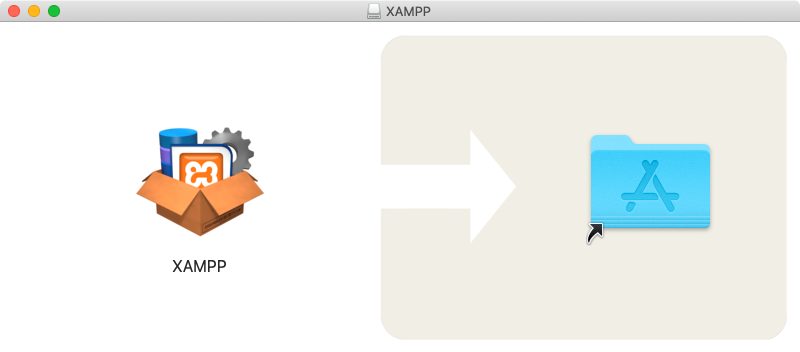</a>

起動（アプリケーションのアイコンをダブルクリック）    
<a href="images/2020-09-24-14-45-19.png">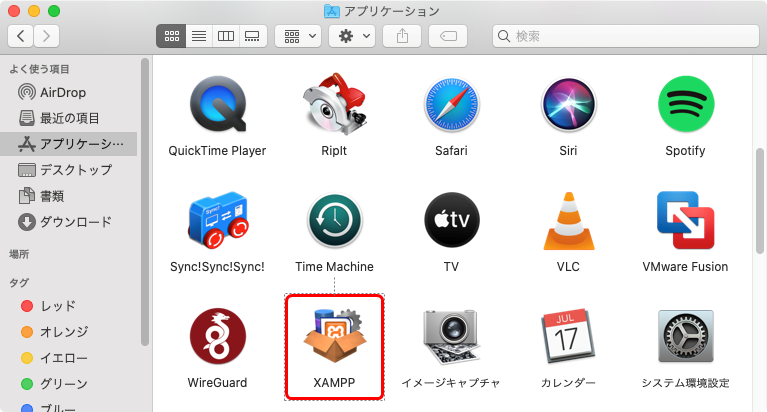</a>

初回実行時は確認メッセージが表示されるので[開く]をクリック  
<a href="images/2020-09-24-14-47-03.png">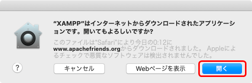</a>

[OK]をクリックし、macOSのユーザー（要管理権限）とパスワードを入力して[OK]をクリック  

<a href="images/2020-09-24-14-54-33.png">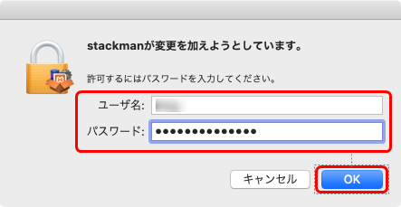</a>


<a id="markdown-dbmsの起動と終了" name="dbmsの起動と終了"></a>
### DBMSの起動と終了

アプリケーションフォルダのXAMPPアイコンをダブルクリックし、「General」タブのStartボタンをクリックします。起動に成功すると、Statusの表示がグリーンになってIPアドレスが表示されます。

DBMSを個別に起動/再起動したい場合は、「Service」タブを使用します。

Generalタブ（XAMPPの開始/終了）  
<a href="images/2020-09-24-14-55-47.png">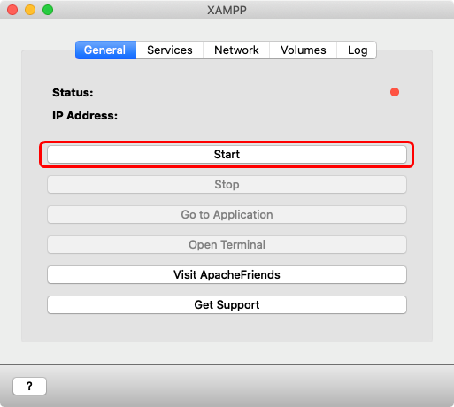</a>
<a href="images/2020-09-24-14-57-02.png">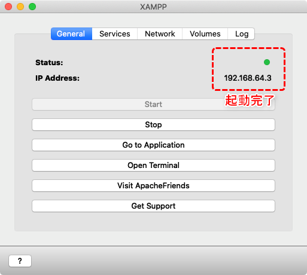</a>

Servicesタブ（DBMSの開始/終了）  
<a href="images/2020-09-24-15-00-58.png">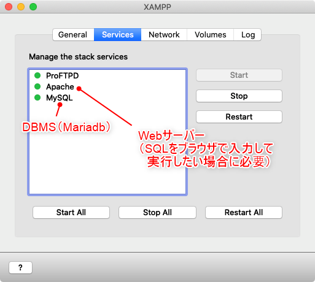</a>

Networkタブ（<a id="macos_xampp_portforwarding" namd="macos_xampp_portforwarding">Port Forwardingの有効化</a>）  
<a href="images/2020-09-24-15-03-38.png">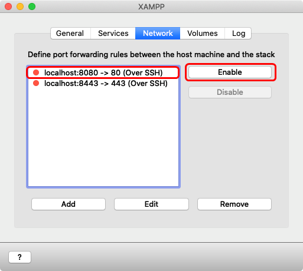</a>
<a href="images/2020-09-24-15-06-16.png">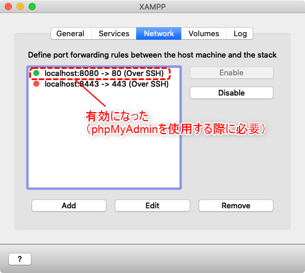</a>

<a id="markdown-phpmyadminの画面を開くには" name="phpmyadminの画面を開くには"></a>
### phpMyAdminの画面を開くには

Webブラウザで以下のURLを開き、右上のphpMyAdminのリンクをクリックします。

http://localhost:8080

<a href="images/2020-09-24-15-18-02.png">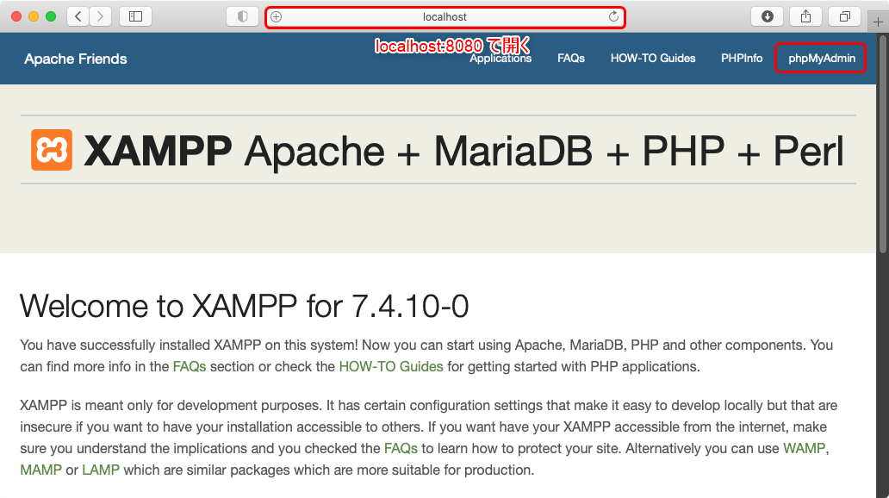</a>
<a href="images/2020-09-24-15-37-44.png">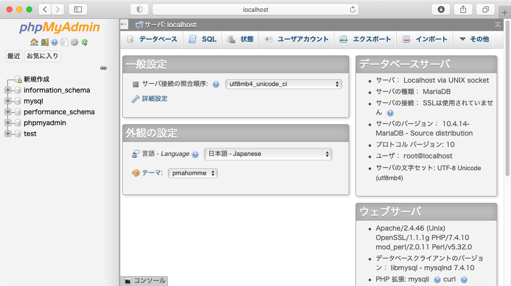</a>

※「General」タブでGo to Applicationをクリック（Webブラウザが開く）→ 右上のphpMyAdminのリンクの場合、XAMPP用のIPアドレスを使用することになるが、この場合は「アクセス禁止」というメッセージが表示される。このIPアドレスでphpMyAdminを使用したい場合はhttpd-xampp.confですべての接続を許可するという設定を行う必要がある。

（参考）  
<a href="images/2020-09-24-15-14-37.png">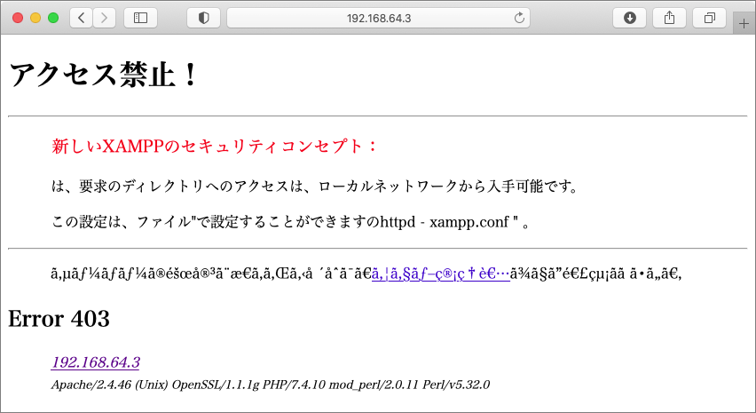</a>

<a id="markdown-adminerを追加するには" name="adminerを追加するには"></a>
### Adminerを追加するには


XAMPPの「Open Terminal」メニューでターミナルを開き、`wget`コマンドでファイルをダウンロードして`/opt/lamp/htdocs`に`adminer.php`という名前で移動します。

```
wget https://github.com/vrana/adminer/releases/download/v4.7.7/adminer-4.7.7.php
sudo mv adminer-4.7.7.php /opt/lamp/htdocs/adminer.php
```

以下のURLで開くことができます。<a href="#macos_xampp_portforwarding">Port Forwardingの設定</a>が必要です。

http://localhost:8080/adminer.php

<a id="markdown-windows環境の場合" name="windows環境の場合"></a>
## Windows環境の場合

<a id="markdown-xamppインストールと起動-1" name="xamppインストールと起動-1"></a>
### XAMPPインストールと起動

インストーラーを実行し、画面に従ってインストールを行います。

<a id="markdown-dbmsの起動と終了-1" name="dbmsの起動と終了-1"></a>
### DBMSの起動と終了

<a id="markdown-phpmyadminの画面を開くには-1" name="phpmyadminの画面を開くには-1"></a>
### phpMyAdminの画面を開くには

<a id="markdown-adminerを追加するには-1" name="adminerを追加するには-1"></a>
### Adminerを追加するには

<a id="markdown-サンプル用データベースおよびテスト用のユーザーの作成" name="サンプル用データベースおよびテスト用のユーザーの作成"></a>
## サンプル用データベースおよびテスト用のユーザーの作成

ユーザーおよびデータベースの追加はphpMyAdminで行います。

<a id="markdown-テスト用ユーザーの作成" name="テスト用ユーザーの作成"></a>
## テスト用ユーザーの作成

adminerやコマンドライン（mysqlコマンド）で接続する場合、あるいは、DBMS管理者以外の権限でphpMyAdminを使用したい場合は、ユーザーを作成する必要があります。

ホスト名は「ローカル」、認証は「ネイティブMySQL認証」を選択してください。


<a id="markdown-データベースの作成" name="データベースの作成"></a>
## データベースの作成
左ペイン（データベースが一覧表示されている）で「新規作成」を選択します。データベースを入れて「作成」をクリックするとデータベースが作成されます。

<a href="images/2020-09-24-15-40-48.png">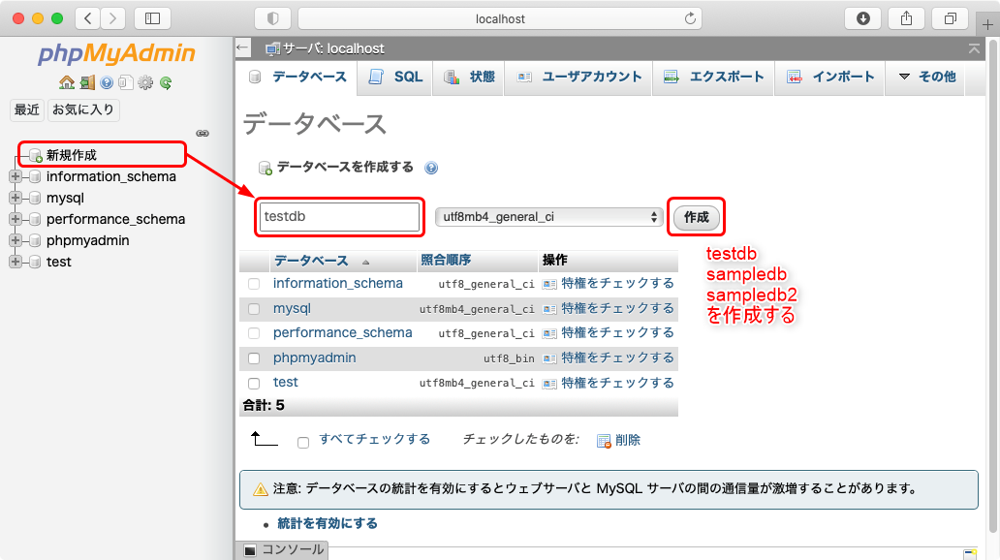</a>


----
[基本がわかるSQL入門 <small>——データベース&設計の基礎から楽しく学ぶ</small> サポートページ](https://nisim-m.github.io/sqlbook/)
