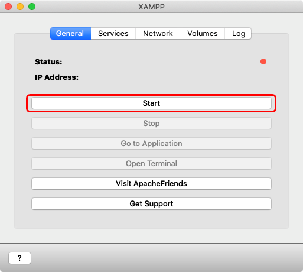
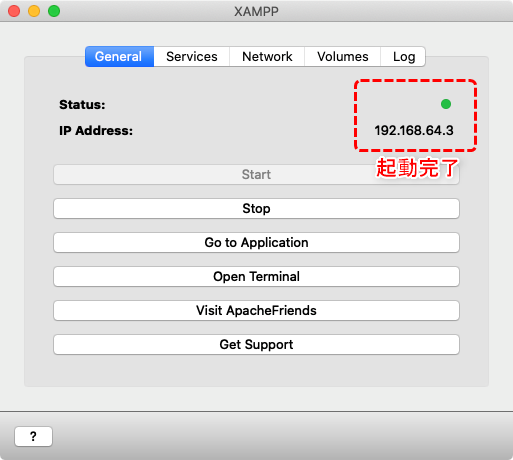
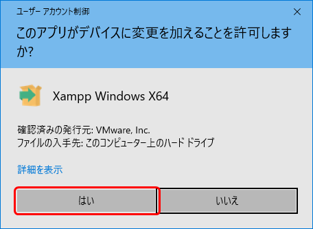
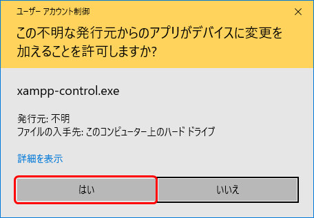
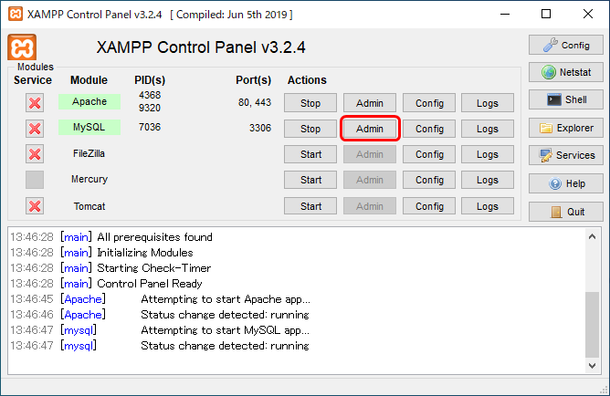
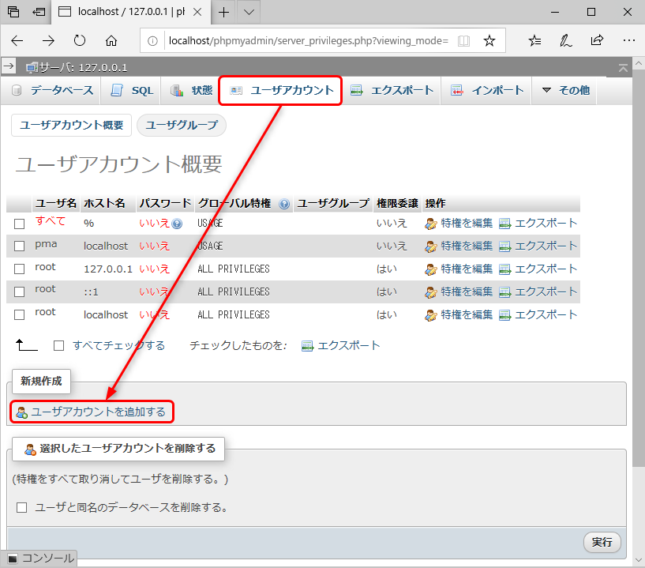
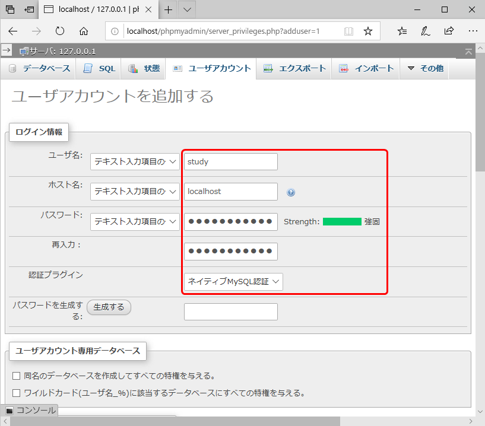
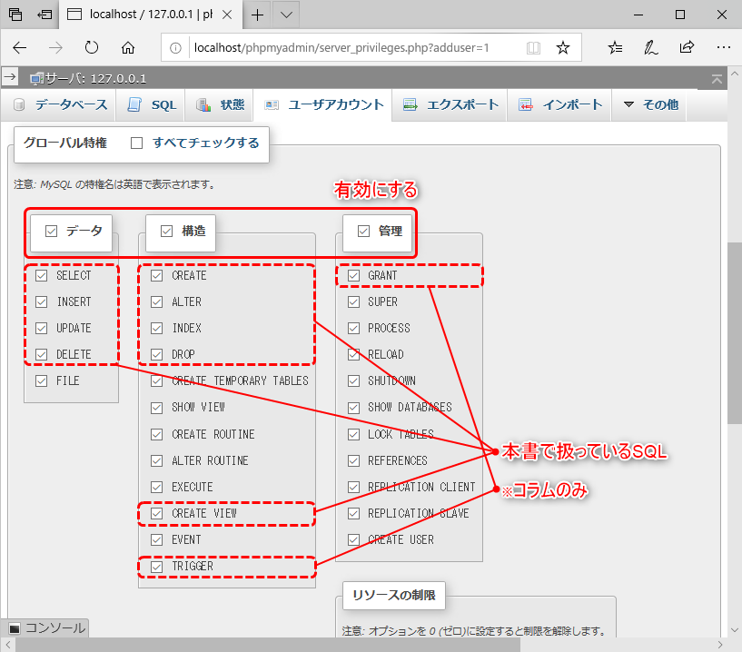
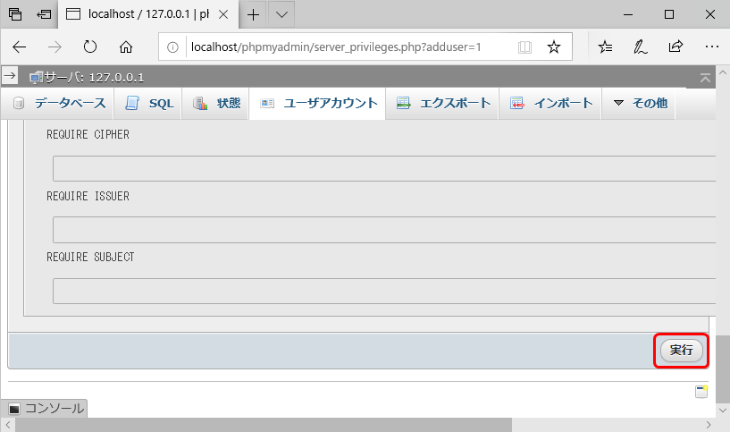

[基本がわかるSQL入門 サポートページ](https://nisim-m.github.io/sqlbook/) ～テスト環境 その2～

<a id="markdown-xampp-macos-windows" name="xampp-macos-windows"></a>
# XAMPP (macOS, Windows)

XAMPP（ザンプ）は、WebサーバーやDBMSなど、Webアプリケーション実行に必要なソフトウェアをまとめたパッケージで、手軽にインストールしてテストするのに向いています。ここでは、XAMPPを利用して、本書のSQLサンプルを試す方法を紹介しています。

XAMPPをインストールすると、DBMSとして**MariaDB**がインストールされます。

MariaDBはMySQLから派生する形で開発されたDBMSです。ターミナルで使用するクライアントコマンドも、MySQLと同じ名前の`mysql`コマンドを使用します。

XAMPPの画面でも「MySQL」と表示されていますが、管理画面であるphpMyAdminの画面で、MariaDBであること、および、MariaDBのバージョンを確認することができます。

<!-- TOC -->

1. [macOS環境の場合](#macos環境の場合)
   1. [XAMPPインストールと起動](#xamppインストールと起動)
   2. [DBMSの起動と終了](#dbmsの起動と終了)
   3. [phpMyAdminの画面を開くには](#phpmyadminの画面を開くには)
   4. [Adminerを追加するには](#adminerを追加するには)
2. [Windows環境の場合](#windows環境の場合)
   1. [XAMPPインストールと起動](#xamppインストールと起動-1)
   2. [DBMSの起動と終了](#dbmsの起動と終了-1)
   3. [参考：XAMPP Control Panelを「管理者として実行」していない場合](#参考xampp-control-panelを管理者として実行していない場合)
   4. [phpMyAdminの画面を開くには](#phpmyadminの画面を開くには-1)
   5. [Adminerを追加するには](#adminerを追加するには-1)
3. [サンプル用データベースおよびテスト用のユーザーの作成](#サンプル用データベースおよびテスト用のユーザーの作成)
4. [テスト用ユーザーの作成](#テスト用ユーザーの作成)
5. [データベースの作成](#データベースの作成)
   1. [データベース一覧が表示されていない場合](#データベース一覧が表示されていない場合)

<!-- /TOC -->

<a id="markdown-macos環境の場合" name="macos環境の場合"></a>
## macOS環境の場合

メモ：
- 「XAMPP-VM stack manager」という管理プログラムと「XAMPP-VM」という仮想環境がインストールされます。
- 仮想環境はLinuxで構築されており、ターミナルを実行するとプロンプトにDebianと表示されます。
- phpMyAdminは、"新しいセキュリティポリシー"が適用されているため、port fowardingを設定した上で（NetworkdタブでEnabledにする）、`http://localhost:8080/phpmyadmin/`でアクセスする必要があります。

<a id="markdown-xamppインストールと起動" name="xamppインストールと起動"></a>
### XAMPPインストールと起動

[OS X 向け XAMPP](https://www.apachefriends.org/jp/download.html#download-apple) からインストーラーをダウンロードしてください。
PHPのバージョンに合わせて複数のバージョンが公開されていますが、通常は最新版で良いでしょう。本書のSQLを実行するにあたっては、どのバージョンでも問題ありません。

ダウンロードしたファイルをダブルクリックで開き、XAMPPアイコンをアプリケーションフォルダにドラッグ＆ドロップします。

インストール（アイコンをドラッグ＆ドロップ）  
<a href="images/2020-09-24-14-39-54.png"></a>

起動（アプリケーションのアイコンをダブルクリック）    
<a href="images/2020-09-24-14-45-19.png"></a>

初回実行時は確認メッセージが表示されるので[開く]をクリック  
<a href="images/2020-09-24-14-47-03.png"></a>

[OK]をクリックし、macOSのユーザー（要管理権限）とパスワードを入力して[OK]をクリック  

<a href="images/2020-09-24-14-54-33.png"></a>


<a id="markdown-dbmsの起動と終了" name="dbmsの起動と終了"></a>
### DBMSの起動と終了

アプリケーションフォルダのXAMPPアイコンをダブルクリックし、「General」タブのStartボタンをクリックします。起動に成功すると、Statusの表示がグリーンになってIPアドレスが表示されます。

DBMSを個別に起動/再起動したい場合は、「Service」タブを使用します。

Generalタブ（XAMPPの開始/終了）  
<a href="images/2020-09-24-14-55-47.png"></a>
<a href="images/2020-09-24-14-57-02.png"></a>

Servicesタブ（DBMSの開始/終了）  
<a href="images/2020-09-24-15-00-58.png"></a>

Networkタブ（<a id="macos_xampp_portforwarding" namd="macos_xampp_portforwarding">Port Forwardingの有効化</a>）  
<a href="images/2020-09-24-15-03-38.png"></a>
<a href="images/2020-09-24-15-06-16.png"></a>

<a id="markdown-phpmyadminの画面を開くには" name="phpmyadminの画面を開くには"></a>
### phpMyAdminの画面を開くには

Webブラウザで以下のURLを開き、右上のphpMyAdminのリンクをクリックします。

http://localhost:8080

<a href="images/2020-09-24-15-18-02.png"></a>
<a href="images/2020-09-24-15-37-44.png"></a>

※「General」タブでGo to Applicationをクリック（Webブラウザが開く）→ 右上のphpMyAdminのリンクの場合、XAMPP用のIPアドレスを使用することになるが、この場合は「アクセス禁止」というメッセージが表示される。このIPアドレスでphpMyAdminを使用したい場合はhttpd-xampp.confですべての接続を許可するという設定を行う必要がある。

（参考）  
<a href="images/2020-09-24-15-14-37.png"></a>

<a id="markdown-adminerを追加するには" name="adminerを追加するには"></a>
### Adminerを追加するには

Adminerは、公式サイト（[https://www.adminer.org/](https://www.adminer.org/)）のDownloadsリンクから入手できます。phpファイル1つで動作します。
種類がいくつかありますが、本書では「Adminer 4.7.7」を使用しています。

XAMPPの「Open Terminal」メニューでターミナルを開き、`wget`コマンドでファイルをダウンロードして`/opt/lamp/htdocs`に`adminer.php`という名前で移動します。

```
wget https://github.com/vrana/adminer/releases/download/v4.7.7/adminer-4.7.7.php
sudo mv adminer-4.7.7.php /opt/lamp/htdocs/adminer.php
```

以下のURLで開くことができます。<a href="#macos_xampp_portforwarding">Port Forwardingの設定</a>が必要です。なお、**ログインにはDBMS用のユーザーを作成する必要があります**（[→phpMyAdminでユーザーを作成するには](#adduerformysql)）。

http://localhost:8080/adminer.php

<a id="markdown-windows環境の場合" name="windows環境の場合"></a>
## Windows環境の場合

<a id="markdown-xamppインストールと起動-1" name="xamppインストールと起動-1"></a>
### XAMPPインストールと起動

[Windows 向け XAMPP](https://www.apachefriends.org/jp/download.html) からインストーラーをダウンロードしてください。
PHPのバージョンに合わせて複数のバージョンが公開されていますが、通常は最新版で良いでしょう。本書のSQLを実行するにあたっては、どのバージョンでも問題ありません。

ダウンロードしたファイルを実行し、画面に従ってインストールを実施してください。
途中、「Windowsセキュリティの重要な警告」が表示され、「Apache HTTP Serverにこれらのネットワーク上での通信を許可する」というメッセージが表示されたら「パブリック ネットワーク」をオフ、「プライベート ネットワーク」をオンにして、「アクセスを許可する(A)」をクリックします。

最後に「Do you want to start the Control Panel now?」というメッセージが表示されるので、
オフにして「Finish」をクリックします。
オフにせず「Finish」をクリックすると「XAMPP Control Panel」が開きますが、いったん終了してください。

<a href="images/2020-09-30-13-05-53.png"></a>
<a href="images/2020-09-30-13-12-53.png"></a>
<a href="images/2020-09-30-13-13-22.png"></a>
<a href="images/2020-09-30-13-15-42.png"></a>

インストール先（デフォルトはC:\xampp、名前にスペースを含んでいない方が扱いやすい）  
<a href="images/2020-09-30-13-16-46.png"></a>
<a href="images/2020-09-30-13-17-57.png"></a>
<a href="images/2020-09-30-13-18-37.png"></a>

（「Lean more about Bitnami for XAMPP」にチェックマークが入っているとWebブラウザが開く）  
<a href="images/2020-09-30-13-18-57.png"></a>

<a href="images/2020-09-30-13-19-57.png"></a>
<a href="images/2020-09-30-13-20-18.png"></a>

通常は「プライベート ネットワーク」のみ有効にして「アクセスを許可する(A)」をクリック  
（他のPCからアクセスしたい場合は「パブリック ネットワーク」にする、要セキュリティ設定 ※本ページでは解説していません）  
<a href="images/2020-09-30-13-21-38.png"></a>

「Do you want to start the Control Panel now?」をオフにして「Finish」をクリック  
<a href="images/2020-09-30-13-42-14.png"></a>

<a id="markdown-dbmsの起動と終了-1" name="dbmsの起動と終了-1"></a>
### DBMSの起動と終了

スタートメニューで「XAMPP Control Panel」を**右クリック**→「その他」→**「管理者として実行」**をクリックして開始してください。

ApacheとMySQLの右側にある「Start」をクリックするとそれぞれが起動します。Apache（Webサーバー）は、phpMyAdminの実行に必要です。

MySQLの初回実行時は、「Windowsセキュリティの重要な警告」が表示され、「mysqldにこれらのネットワーク上での通信を許可する」というメッセージが表示されるので「パブリック ネットワーク」をオフ、「プライベート ネットワーク」をオンにして、「アクセスを許可する(A)」をクリックします。

起動できると、Module欄の色が緑色に、ボタンの表示が「Stop」に変わります。

終了時は「Stop」をクリックし、右下の「Quit」ボタンでXAMPPを終了します。

<a href="images/2020-09-30-13-51-14.png"></a>

<a href="images/2020-09-30-13-52-49.png"></a>
<a href="images/2020-09-30-13-52-13.png"></a>

※初回のみ  
通常は「プライベート ネットワーク」のみ有効にして「アクセスを許可する(A)」をクリック  
（他のPCからアクセスしたい場合は「パブリック ネットワーク」にする、要セキュリティ設定 ※本ページでは解説していません）    
<a href="images/2020-09-30-13-31-17.png"></a>

（起動できた）  
<a href="images/2020-09-30-14-03-37.png"></a>

<a id="markdown-参考xampp-control-panelを管理者として実行していない場合" name="参考xampp-control-panelを管理者として実行していない場合"></a>
### 参考：XAMPP Control Panelを「管理者として実行」していない場合

XAMPP Control Panel「管理者として実行」をしていない場合、終了時に「アクセスが拒否されました」や「Exception EAccessViolation」などのエラーが発生することがあります。「OK」をクリックしても終了できない場合は、タスクマネージャーなどを使ってXAMPPを終了し、あらためて「管理者として実行」で起動してください。

※参考  
「管理者として実行」をしていないと以下の表示になる（「Start」をクリックしてApacheとMySQLを実行することはできるが、設定変更時やXAMPP Contol Panelを終了する時にエラーになることがある）  
<a href="images/2020-09-30-13-58-07.png"></a>

<a id="markdown-phpmyadminの画面を開くには-1" name="phpmyadminの画面を開くには-1"></a>
### phpMyAdminの画面を開くには

phpMyAdminの画面を開くには、ApacheとMySQLを開始している状態で以下のURLを開くか、XAMPP Contol PanelのMySQLの右側の「Admin」ボタンをクリックします。

http://localhost/phpmyadmin/

<a href="images/2020-09-30-14-04-13.png"></a>

<a href="images/2020-09-30-14-02-16.png"></a>

<a id="markdown-adminerを追加するには-1" name="adminerを追加するには-1"></a>
### Adminerを追加するには

Adminerは、公式サイト（[https://www.adminer.org/](https://www.adminer.org/)）の[Downloadsリンク](https://www.adminer.org/en/#download)から入手できます。phpファイル1つで動作します。
種類がいくつかありますが、本書では「Adminer 4.7.7」を使用しています。

リンクをクリックして「adminer-4.7.7.php」を保存し、ファイル名を「adminer.php」に変更して「C:\xampp\htdocs」に移動してください。

「C:\xampp」はXAMPPのインストールディレクトリです。場所がよくわからない場合や、別の場所にインストールした場合は、XAMPP Control Panelで「Explorer」をクリックしてエクスプローラーを開き、htdocsフォルダを開くと良いでしょう。

adminer.phpを配置すると、以下のURLでAdminerを表示できます。なお、**ログインにはDBMS用のユーザーを作成する必要があります**（[→phpMyAdminでユーザーを作成するには](#adduerformysql)）。

http://localhost/adminer.php

<a id="markdown-サンプル用データベースおよびテスト用のユーザーの作成" name="サンプル用データベースおよびテスト用のユーザーの作成"></a>
## サンプル用データベースおよびテスト用のユーザーの作成

<a id="#adduerformysql" name="#adduerformysql"></a>ユーザーおよびデータベースの追加はphpMyAdminで行います。

<a id="markdown-テスト用ユーザーの作成" name="テスト用ユーザーの作成"></a>
## テスト用ユーザーの作成

adminerやコマンドライン（mysqlコマンド）で接続する場合、あるいは、DBMS管理者以外の権限でphpMyAdminを使用したい場合は、ユーザーを作成する必要があります。

ホスト名は「ローカル」、認証は「ネイティブMySQL認証」を選択してください。

phpMyAdminの「ユーザアカウント」で「新規作成」の「ユーザアカウントを追加する」をクリックします。  
<a href="images/2020-09-30-14-36-42.png"></a>

「ログイン情報」を入力してスクロールします。ユーザー名は任意です（本書ではユーザー名「study」を使用しています）。  
ホスト名は「localhost」、認証プラグインは「ネイティブMySQL認証」を選択してください。  
<a href="images/2020-09-30-14-37-50.png"></a>

「グローバル特権」で「データ」「構造」「管理」にチェックを入れます。  
<a href="images/2020-09-30-14-45-55.png"></a>

画面下部の「実行」をクリックする  
<a href="images/2020-09-30-14-46-22.png"></a>

<a id="markdown-データベースの作成" name="データベースの作成"></a>
## データベースの作成
左ペイン（データベースが一覧表示されている）で「新規作成」を選択します。データベースを入れて「作成」をクリックするとデータベースが作成されます。

<a href="images/2020-09-24-15-40-48.png"></a>

[→サンプルデータ](../index.md#sampledata)

<a id="markdown-データベース一覧が表示されていない場合" name="データベース一覧が表示されていない場合"></a>
### データベース一覧が表示されていない場合

データベース一覧の表示・非表示は、画面左上の矢印ボタンで変更できます。  
<a href="images/2020-09-30-15-27-41.png"></a>
<a href="images/2020-09-30-15-26-05.png"></a>

----
[基本がわかるSQL入門 <small>——データベース&設計の基礎から楽しく学ぶ</small> サポートページ](https://nisim-m.github.io/sqlbook/)
